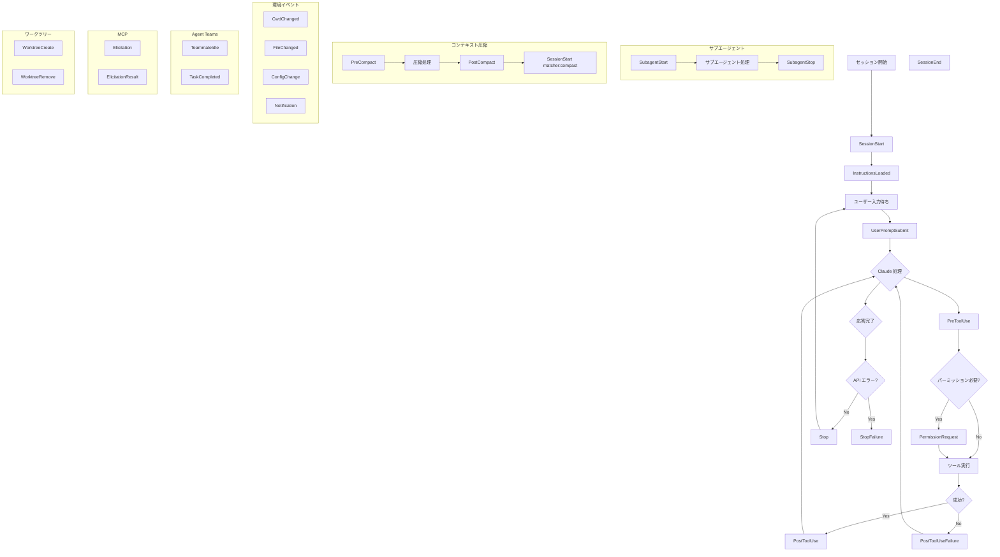

---
tags:
  - investigation
  - claude-code
  - hooks
  - automation
---
# Claude Code Hooks 全イベントリファレンス

## 概要

Claude Code の hooks 機能は、セッションライフサイクルの特定タイミングでシェルコマンドや HTTP リクエスト、LLM 評価を自動実行する仕組みである。全 24 イベントが定義されている（[Hooks reference](https://code.claude.com/docs/en/hooks)）。

フックには 4 つのタイプがある（[Hooks guide](https://code.claude.com/docs/en/hooks-guide)）:

| タイプ | 説明 |
|--------|------|
| `command` | シェルコマンド実行（デフォルト） |
| `http` | HTTP エンドポイントに POST |
| `prompt` | 単一ターン LLM 評価（デフォルト Haiku） |
| `agent` | マルチターン検証（ツールアクセス付き、最大50ターン） |

## 共通仕様

### 共通入力フィールド

全イベントの stdin JSON に含まれるフィールド（[Hooks reference](https://code.claude.com/docs/en/hooks)）:

- `session_id` (string) -- セッション固有 ID
- `transcript_path` (string) -- トランスクリプトファイルパス
- `cwd` (string) -- イベント発火時の作業ディレクトリ
- `hook_event_name` (string) -- イベント名
- `agent_id` (string, optional) -- サブエージェント内でのみ付与
- `agent_type` (string, optional) -- サブエージェント内でのみ付与

### 汎用出力フィールド

全イベントで使用可能な出力フィールド（[Hooks reference](https://code.claude.com/docs/en/hooks)）:

- `continue` (boolean, default: true) -- false でセッション停止
- `stopReason` (string, optional) -- 停止理由
- `suppressOutput` (boolean, default: false) -- 出力抑制
- `systemMessage` (string, optional) -- システムメッセージ注入

### 終了コード

command タイプのフックで使用（[Hooks guide](https://code.claude.com/docs/en/hooks-guide)）:

- **0**: アクション続行。stdout はコンテキストに追加（SessionStart, UserPromptSubmit）
- **2**: アクションブロック。stderr が Claude へのフィードバックになる
- **その他**: アクション続行。stderr はログのみ（verbose モードで確認可能）

## 全 24 イベント詳細

### セッションライフサイクル

#### 1. SessionStart

セッション開始・再開時に発火する（[Hooks reference](https://code.claude.com/docs/en/hooks)）。

- **matcher**: `startup`, `resume`, `clear`, `compact`
- **固有入力**: `source`（発火理由）, `model`, `agent_type`
- **固有出力**: `additionalContext`（コンテキスト注入文字列）
- **フックタイプ制限**: command のみ
- **ユースケース**: 開発コンテキスト注入、環境変数セットアップ。matcher `compact` を使えば compaction 後に重要情報を再注入できる（[Hooks guide](https://code.claude.com/docs/en/hooks-guide)）

#### 2. SessionEnd

セッション終了時に発火する（[Hooks reference](https://code.claude.com/docs/en/hooks)）。

- **matcher**: `clear`, `resume`, `logout`, `prompt_input_exit`, `bypass_permissions_disabled`, `other`
- **固有入力**: なし（共通フィールドのみ）
- **出力制御**: なし（決定権なし）
- **ユースケース**: クリーンアップ、ログ記録、最終レポート送信

#### 3. InstructionsLoaded

CLAUDE.md や `.claude/rules/*.md` がコンテキストに読み込まれた時に発火する（[Hooks reference](https://code.claude.com/docs/en/hooks)）。

- **matcher**: `session_start`, `nested_traversal`, `path_glob_match`, `include`, `compact`
- **固有入力**: `file_path`, `memory_type`（User / Project / Local / Managed）, `load_reason`, `globs`（frontmatter 由来）, `trigger_file_path`, `parent_file_path`
- **出力制御**: なし（監査専用）
- **ユースケース**: どのルールファイルが読み込まれたかの監査ログ、コンプライアンス追跡

### プロンプト処理

#### 4. UserPromptSubmit

ユーザーがプロンプトを送信した時、Claude が処理する前に発火する（[Hooks reference](https://code.claude.com/docs/en/hooks)）。

- **matcher**: なし（全プロンプトで発火）
- **固有入力**: `prompt`, `permission_mode`
- **固有出力**: `decision`（"block" でプロンプト処理を中止）, `reason`, `additionalContext`（コンテキスト追加注入）
- **ユースケース**: プロンプト内容に応じたコンテキスト追加、不正プロンプトのブロック、入力バリデーション

### ツール実行

#### 5. PreToolUse

ツールコール実行前に発火する（[Hooks reference](https://code.claude.com/docs/en/hooks)）。

- **matcher**: ツール名。`Bash`, `Edit`, `Write`, `Read`, `Glob`, `Grep`, `Agent`, `WebFetch`, `WebSearch`, `mcp__.*` パターンに対応
- **固有入力**: `tool_name`, `tool_input`（ツールごとにスキーマが異なる）, `tool_use_id`, `permission_mode`
- **ツール別 tool_input の主要フィールド**（[Hooks reference](https://code.claude.com/docs/en/hooks)）:
  - **Bash**: `command`, `description`, `timeout`, `run_in_background`
  - **Write**: `file_path`, `content`
  - **Edit**: `file_path`, `old_string`, `new_string`, `replace_all`
  - **Read**: `file_path`, `offset`, `limit`
  - **Glob**: `pattern`, `path`
  - **Grep**: `pattern`, `path`, `glob`, `output_mode`, `-i`, `multiline`
  - **WebFetch**: `url`, `prompt`
  - **WebSearch**: `query`, `allowed_domains`, `blocked_domains`
  - **Agent**: `prompt`, `description`, `subagent_type`, `model`
- **固有出力**: `permissionDecision`（"allow" / "deny" / "ask"）, `permissionDecisionReason`, `updatedInput`（入力パラメータの上書き）
- **ユースケース**: 破壊的コマンド（`rm -rf`, `drop table` 等）のブロック、ツール入力のバリデーション・修正、安全なコマンドの自動許可

#### 6. PermissionRequest

パーミッションダイアログが表示される時に発火する（[Hooks reference](https://code.claude.com/docs/en/hooks)）。

- **matcher**: ツール名（PreToolUse と同じ）
- **固有入力**: `tool_name`, `tool_input`, `permission_suggestions`
- **固有出力**:
  - `decision.behavior`（"allow" / "deny"）
  - `decision.updatedInput`（入力上書き）
  - `decision.updatedPermissions`（パーミッションルール変更の配列）
  - `decision.message`（deny 時のメッセージ）
  - `decision.interrupt`（deny 時に割り込むか）
- **updatedPermissions の操作タイプ**（[Hooks reference](https://code.claude.com/docs/en/hooks)）: `addRules`, `replaceRules`, `removeRules`, `setMode`, `addDirectories`, `removeDirectories`
- **destination**: `session`, `localSettings`, `projectSettings`, `userSettings`
- **注意**: 非対話モード（`-p`）では発火しない。自動パーミッション制御には PreToolUse を使う（[Hooks guide](https://code.claude.com/docs/en/hooks-guide)）
- **ユースケース**: ExitPlanMode の自動承認、安全な操作の承認ダイアログスキップ、パーミッションモードの動的変更

#### 7. PostToolUse

ツールコール成功後に発火する（[Hooks reference](https://code.claude.com/docs/en/hooks)）。

- **matcher**: ツール名
- **固有入力**: `tool_name`, `tool_input`, `tool_response`, `tool_use_id`, `permission_mode`
- **固有出力**: `decision`（"block"）, `reason`, `additionalContext`, `updatedMCPToolOutput`（MCP ツール専用、レスポンス上書き）
- **注意**: 実行済みアクションは取り消せない（[Hooks guide](https://code.claude.com/docs/en/hooks-guide)）
- **ユースケース**: ファイル編集後の自動フォーマット（Prettier 等）、リント実行、操作ログ記録

#### 8. PostToolUseFailure

ツールコール失敗後に発火する（[Hooks reference](https://code.claude.com/docs/en/hooks)）。

- **matcher**: ツール名
- **固有入力**: `tool_name`, `tool_input`, `tool_use_id`, `error`, `is_interrupt`
- **固有出力**: `additionalContext`（リカバリ用コンテキスト）
- **ユースケース**: エラーログ記録、リカバリヒントの注入、デバッグ情報収集

### 応答完了

#### 9. Stop

Claude の応答が完了した時に発火する（[Hooks reference](https://code.claude.com/docs/en/hooks)）。

- **matcher**: なし
- **固有入力**: `stop_hook_active`（Stop フックが既に動作中か）, `last_assistant_message`, `permission_mode`
- **固有出力**: `decision`（"block" で応答完了を阻止し継続）, `reason`（block 時は必須）
- **注意**: ユーザー割り込み時は発火しない。API エラー時は StopFailure が代わりに発火する（[Hooks guide](https://code.claude.com/docs/en/hooks-guide)）。無限ループ防止のため `stop_hook_active` を確認すること
- **ユースケース**: タスク完了の品質ゲート、条件付き作業継続の強制

#### 10. StopFailure

API エラーでターンが終了した時に発火する（Stop の代わり）（[Hooks reference](https://code.claude.com/docs/en/hooks)）。

- **matcher**: エラータイプ -- `rate_limit`, `authentication_failed`, `billing_error`, `invalid_request`, `server_error`, `max_output_tokens`, `unknown`
- **固有入力**: `error`, `error_details`, `last_assistant_message`
- **出力制御**: なし（出力・終了コードは無視される）
- **ユースケース**: エラーアラート送信、エラー頻度のログ記録

### サブエージェント

#### 11. SubagentStart

サブエージェント起動時に発火する（[Hooks reference](https://code.claude.com/docs/en/hooks)）。

- **matcher**: エージェントタイプ -- `Bash`, `Explore`, `Plan`, またはカスタム名
- **固有入力**: `agent_id`, `agent_type`
- **固有出力**: `additionalContext`
- **ユースケース**: サブエージェントへのコンテキスト注入、起動ログ、ガバナンス制御

#### 12. SubagentStop

サブエージェント終了時に発火する（[Hooks reference](https://code.claude.com/docs/en/hooks)）。

- **matcher**: エージェントタイプ（SubagentStart と同じ）
- **固有入力**: `agent_id`, `agent_type`, `agent_transcript_path`, `last_assistant_message`, `stop_hook_active`, `permission_mode`
- **固有出力**: `decision`（"block"）, `reason`（block 時は必須）
- **ユースケース**: サブエージェント出力の品質ゲート、成果物バリデーション

### Agent Teams

#### 13. TeammateIdle

Agent Team のチームメイトがアイドル状態になる直前に発火する（[Hooks reference](https://code.claude.com/docs/en/hooks)）。

- **matcher**: なし
- **固有入力**: `teammate_name`, `team_name`, `permission_mode`
- **出力制御**: exit code 2 で stderr をフィードバックとして送信しチームメイトの作業を継続させる。`continue: false` でチームメイトを停止
- **ユースケース**: アイドル前の品質チェック、リント実行、成果物検証

#### 14. TaskCompleted

タスクが完了としてマークされた時に発火する（[Hooks reference](https://code.claude.com/docs/en/hooks)）。

- **matcher**: なし
- **固有入力**: `task_id`, `task_subject`, `task_description`, `teammate_name`, `team_name`, `permission_mode`
- **出力制御**: exit code 2 でタスクを未完了に戻し stderr をフィードバック。`continue: false` で停止
- **ユースケース**: 完了基準の強制（テスト通過確認等）、タスク完了時の通知

### 設定・環境

#### 15. ConfigChange

セッション中に設定ファイルが変更された時に発火する（[Hooks reference](https://code.claude.com/docs/en/hooks)）。

- **matcher**: `user_settings`, `project_settings`, `local_settings`, `policy_settings`, `skills`
- **固有入力**: `source`, `file_path`
- **固有出力**: `decision`（"block"）, `reason`
- **注意**: `policy_settings` はブロック不可（[Hooks reference](https://code.claude.com/docs/en/hooks)）
- **ユースケース**: 設定変更の監査ログ、不正な設定変更のブロック

#### 16. CwdChanged

作業ディレクトリが変更された時（Claude が `cd` コマンドを実行した時等）に発火する（[Hooks reference](https://code.claude.com/docs/en/hooks)）。

- **matcher**: なし
- **固有入力**: `old_cwd`, `new_cwd`
- **固有出力**: `watchPaths`（監視対象の絶対パス配列）
- **特殊機能**: `CLAUDE_ENV_FILE` 環境変数で環境変数を永続化可能（[Hooks guide](https://code.claude.com/docs/en/hooks-guide)）
- **フックタイプ制限**: command のみ
- **ユースケース**: direnv 連携による環境変数自動リロード、プロジェクト固有ツールチェーンの切替

#### 17. FileChanged

監視対象ファイルがディスク上で変更された時に発火する（[Hooks reference](https://code.claude.com/docs/en/hooks)）。

- **matcher**: ファイルの basename（例: `.envrc|.env`）。matcher が監視対象ファイルの指定とフィルタリングを兼ねる
- **固有入力**: `file_path`, `event`（"change" / "add" / "unlink"）
- **固有出力**: `watchPaths`（追加監視パス）
- **特殊機能**: `CLAUDE_ENV_FILE` アクセス可能
- **フックタイプ制限**: command のみ
- **ユースケース**: `.envrc` 変更時の環境変数リロード、設定ファイル変更の動的検知

### コンテキスト圧縮

#### 18. PreCompact

コンテキスト圧縮（compaction）前に発火する（[Hooks reference](https://code.claude.com/docs/en/hooks)）。

- **matcher**: `manual`, `auto`
- **固有入力**: なし（共通フィールドのみ）
- **出力制御**: なし（決定権なし）
- **ユースケース**: 圧縮前のログ記録、可観測性

#### 19. PostCompact

コンテキスト圧縮完了後に発火する（[Hooks reference](https://code.claude.com/docs/en/hooks)）。

- **matcher**: `manual`, `auto`
- **固有入力**: なし（共通フィールドのみ）
- **出力制御**: なし（決定権なし）
- **ユースケース**: 圧縮後のログ記録、可観測性

### 通知

#### 20. Notification

Claude Code が通知を送信する時に発火する（[Hooks reference](https://code.claude.com/docs/en/hooks)）。

- **matcher**: `permission_prompt`, `idle_prompt`, `auth_success`, `elicitation_dialog`
- **固有入力**: `message`, `title`, `notification_type`
- **固有出力**: `additionalContext`
- **ユースケース**: デスクトップ通知（macOS: osascript, Linux: notify-send）、Slack / Discord への通知転送

### MCP Elicitation

#### 21. Elicitation

MCP サーバーがツールコール中にユーザー入力を要求した時に発火する（[Hooks reference](https://code.claude.com/docs/en/hooks)）。

- **matcher**: MCP サーバー名
- **固有入力**: MCP サーバー名、elicitation 詳細
- **固有出力**: `action`（"accept" / "decline" / "cancel"）, `content`（フォームフィールド値）
- **ユースケース**: フォーム入力の自動補完、特定 elicitation のブロック

#### 22. ElicitationResult

MCP elicitation にユーザーが応答した後、サーバーに送信される前に発火する（[Hooks reference](https://code.claude.com/docs/en/hooks)）。

- **matcher**: MCP サーバー名
- **固有入力**: ユーザーの応答詳細
- **固有出力**: `action`（"accept" / "decline" / "cancel"）, `content`（上書き値）
- **ユースケース**: ユーザー応答の変更・バリデーション

### ワークツリー

#### 23. WorktreeCreate

`--worktree` フラグまたはサブエージェント分離でワーキングコピーが作成される時に発火する（[Hooks reference](https://code.claude.com/docs/en/hooks)）。

- **matcher**: なし
- **固有入力**: `name`（worktree slug 識別子）
- **出力**: command hook は stdout にパスを出力。HTTP hook は `{ "hookSpecificOutput": { "hookEventName": "WorktreeCreate", "worktreePath": "/path" } }` を返す
- **ユースケース**: git 以外の VCS（SVN, Perforce, Mercurial）でのワークツリー作成統合

#### 24. WorktreeRemove

セッション終了時またはサブエージェント完了時にワークツリーが削除される時に発火する（[Hooks reference](https://code.claude.com/docs/en/hooks)）。

- **matcher**: なし
- **固有入力**: `name`, `path`
- **出力制御**: なし（失敗はデバッグモードでのみログ出力）
- **ユースケース**: VCS クリーンアップ処理

## イベントライフサイクル図

## matcher 対応表

| イベント | matcher 対象 | 例 |
|----------|-------------|-----|
| PreToolUse / PostToolUse / PostToolUseFailure / PermissionRequest | ツール名 | `Bash`, `Edit\|Write`, `mcp__.*` |
| SessionStart | 起動理由 | `startup`, `resume`, `clear`, `compact` |
| SessionEnd | 終了理由 | `clear`, `resume`, `logout` |
| Notification | 通知タイプ | `permission_prompt`, `idle_prompt` |
| SubagentStart / SubagentStop | エージェントタイプ | `Bash`, `Explore`, `Plan` |
| PreCompact / PostCompact | 圧縮トリガー | `manual`, `auto` |
| ConfigChange | 設定ソース | `user_settings`, `project_settings`, `skills` |
| StopFailure | エラータイプ | `rate_limit`, `server_error` |
| InstructionsLoaded | 読込理由 | `session_start`, `compact` |
| Elicitation / ElicitationResult | MCP サーバー名 | 設定済みサーバー名 |
| FileChanged | ファイル basename | `.envrc\|.env` |
| UserPromptSubmit / Stop / TeammateIdle / TaskCompleted / CwdChanged / WorktreeCreate / WorktreeRemove | matcher 非対応 | 常に全発火 |

## フック設定の配置場所

| 場所 | スコープ | 共有 |
|------|---------|------|
| `~/.claude/settings.json` | 全プロジェクト | 不可（ローカル専用）（[Hooks guide](https://code.claude.com/docs/en/hooks-guide)） |
| `.claude/settings.json` | 単一プロジェクト | 可（リポジトリにコミット）（[Hooks guide](https://code.claude.com/docs/en/hooks-guide)） |
| `.claude/settings.local.json` | 単一プロジェクト | 不可（gitignore 対象）（[Hooks guide](https://code.claude.com/docs/en/hooks-guide)） |
| マネージドポリシー | 組織全体 | 可（管理者制御）（[Hooks guide](https://code.claude.com/docs/en/hooks-guide)） |
| プラグイン `hooks/hooks.json` | プラグイン有効時 | 可（プラグインにバンドル）（[Hooks guide](https://code.claude.com/docs/en/hooks-guide)） |
| スキル/エージェント frontmatter | 実行中のみ | 可（コンポーネント定義内）（[Hooks guide](https://code.claude.com/docs/en/hooks-guide)） |
