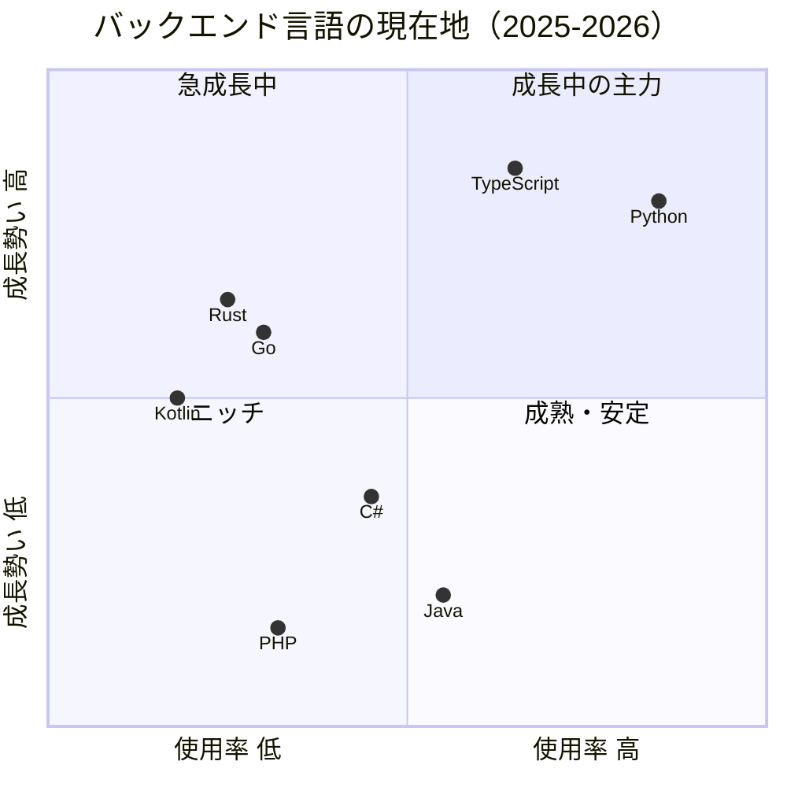
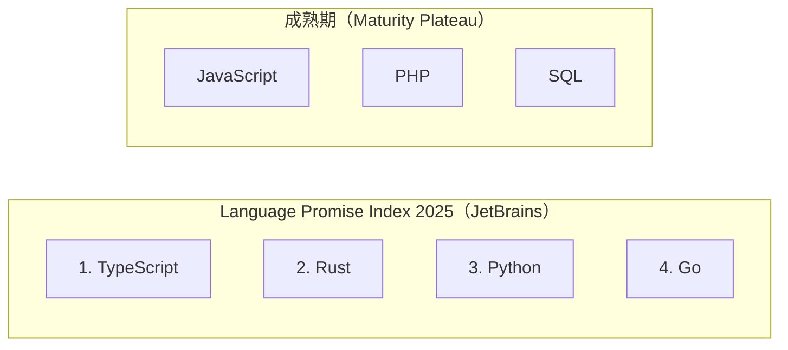

---
tags:
  - investigation
  - backend
  - programming-languages
  - trends
  - python
  - typescript
  - rust
  - go
  - kotlin
  - java
  - csharp
  - php
---
# バックエンド言語の採用トレンド 2024-2026

## サマリー

2024-2026 年のバックエンド言語動向を複数の調査ソースから横断的に整理した。主要な傾向は以下の通り。

- **Python** が使用率で圧倒的首位を維持し、AI/ML 需要を背景にさらにシェアを拡大している
- **TypeScript** が GitHub コントリビュータ数で 1 位に躍進し、フルスタック開発の中心言語として急成長している
- **Go** と **Rust** が着実に使用率を伸ばしているが、採用される企業規模・ユースケースが異なる
- **Java** は依然として高い使用率を保つが、複数指標で長期的な下落傾向が続いている
- **Kotlin** は Java 既存資産の近代化を軸にバックエンド領域での存在感を増している
- **C#** は TIOBE で上昇する一方、他指標では停滞しており評価が分かれる
- **PHP** は成熟期に入り、緩やかな下落が続いている

## 勢力図

JetBrains Language Promise Index 2025 では TypeScript, Rust, Python, Go が成長ポテンシャル上位とされ、JavaScript, PHP, SQL は成熟期に達したとされる（[JetBrains Tools and Trends](https://devecosystem-2025.jetbrains.com/tools-and-trends)）。

## 使用率の横断比較

### Stack Overflow Developer Survey

| 言語 | 2024 全体 | 2025 全体 | 前年比 | 2025 Professional |
|------|----------|----------|--------|-------------------|
| Python | 51.0% | 57.9% | +6.9pp | 54.8% |
| TypeScript | 38.5% | 43.6% | +5.1pp | 48.8% |
| Java | 30.3% | 29.4% | -0.9pp | — |
| C# | 27.1% | 27.8% | +0.7pp | — |
| PHP | 18.2% | 18.9% | +0.7pp | — |
| Go | 13.5% | 16.4% | +2.9pp | 17.4% |
| Rust | 12.6% | 14.8% | +2.2pp | 14.5% |
| Kotlin | 9.4% | 10.8% | +1.4pp | 11.5% |

出典: [Stack Overflow Developer Survey 2024 - Technology](https://survey.stackoverflow.co/2024/technology), [Stack Overflow Developer Survey 2025 - Technology](https://survey.stackoverflow.co/2025/technology)

### TIOBE Index（2026年3月）

| 順位 | 言語 | レーティング | 前年比 |
|------|------|-------------|--------|
| 1 | Python | 21.25% | -2.59% |
| 4 | Java | 7.99% | -2.37% |
| 5 | C# | 6.36% | +1.49% |
| 14 | Rust | 1.31% | +0.09% |
| 16 | Go | 1.29% | -1.49% |
| 18 | PHP | 1.23% | -0.25% |
| 22 | Kotlin | 0.82% | — |
| 35 | TypeScript | 0.34% | — |

出典: [TIOBE Index for March 2026](https://www.tiobe.com/tiobe-index/)

Kotlin・TypeScript は 21 位以下で前年比の数値が公式ページ上で提供されていなかった（[TIOBE Index for March 2026](https://www.tiobe.com/tiobe-index/)）。TypeScript が TIOBE で 35 位と低いのは、検索エンジンベースの指標が TypeScript と JavaScript を区別しにくいという特性がある可能性がある（未検証）。

### PYPL Index（2026年3月取得）

| 順位 | 言語 | シェア | 前年比 |
|------|------|--------|--------|
| 1 | Python | 34.87% | +4.4% |
| 3 | Java | 9.82% | -5.4% |
| 7 | Rust | 3.08% | -0.0% |
| 8 | C# | 3.03% | -3.1% |
| 9 | PHP | 2.90% | -0.8% |
| 12 | TypeScript | 1.85% | -0.8% |
| 17 | Kotlin | 0.96% | -0.8% |
| 21 | Go | 0.67% | -1.3% |

出典: [PYPL PopularitY of Programming Language Index](https://pypl.github.io/PYPL.html)

PYPL のデータは JavaScript による動的表示のため、表示されたデータが 2026年3月分である保証はない（[PYPL Index](https://pypl.github.io/PYPL.html)）。

### JetBrains State of Developer Ecosystem（2024-2025）

2024 版（23,262 名対象）では Python 57%、TypeScript 37%、Java 46%、Rust 11% の使用率が報告されている（[InfoWorld](https://www.infoworld.com/article/3625652/javascript-is-still-number-one-jetbrains-report.html)）。2025 版（24,534 名、194 か国対象）ではインタラクティブチャートでの提供のため具体的パーセンテージは未確認だが、TypeScript が過去 5 年間で最も劇的に使用率が伸びた言語とされている（[JetBrains Tools and Trends](https://devecosystem-2025.jetbrains.com/tools-and-trends)）。

## 言語別動向

### Python

- Stack Overflow 使用率 57.9%（前年比 +6.9pp）で全言語中最大の成長幅（[Stack Overflow Developer Survey 2025 - Technology](https://survey.stackoverflow.co/2025/technology)）
- TIOBE 1 位（21.25%）、PYPL 1 位（34.87%、前年比 +4.4%）と全指標で首位（[TIOBE Index for March 2026](https://www.tiobe.com/tiobe-index/), [PYPL Index](https://pypl.github.io/PYPL.html)）
- AI・データサイエンス・バックエンドの需要が成長を牽引（[Stack Overflow Developer Survey 2025 - Technology](https://survey.stackoverflow.co/2025/technology)）
- JetBrains Language Promise Index で 3 位。成長ポテンシャルは依然として高い（[JetBrains GoLand Blog](https://blog.jetbrains.com/go/2025/11/10/go-language-trends-ecosystem-2025/)）
- JetBrains の 5 年推移: 2017 年の 32% から 2024 年の 57% へ +25pp 成長（[InfoWorld](https://www.infoworld.com/article/3625652/javascript-is-still-number-one-jetbrains-report.html)）
- TIOBE では前年比 -2.59% と微減しており、検索エンジン上のコンテンツ量ベースでは飽和傾向が見られる（[TIOBE Index for March 2026](https://www.tiobe.com/tiobe-index/)）

### TypeScript

- Stack Overflow 使用率 43.6%（前年比 +5.1pp）、Professional Developers では 48.8%（[Stack Overflow Developer Survey 2025 - Technology](https://survey.stackoverflow.co/2025/technology)）
- 2025 年 8 月に GitHub 月間コントリビュータ数で 1 位に到達。月間 2,636,006 人、前年比 +66.63%（[GitHub Blog - Octoverse 2025](https://github.blog/news-insights/octoverse/octoverse-a-new-developer-joins-github-every-second-as-ai-leads-typescript-to-1/)）
- JetBrains Language Promise Index で 1 位（[JetBrains GoLand Blog](https://blog.jetbrains.com/go/2025/11/10/go-language-trends-ecosystem-2025/)）
- Admired（使用継続意向）72.4% で対象言語中最高（[Stack Overflow Developer Survey 2025 - Technology](https://survey.stackoverflow.co/2025/technology)）
- 型付き言語が AI コード生成との親和性が高い点、主要フレームワーク（Next.js 等）がデフォルトで TypeScript を採用している点が GitHub での躍進の背景（[GitHub Blog - Octoverse 2025](https://github.blog/news-insights/octoverse/octoverse-a-new-developer-joins-github-every-second-as-ai-leads-typescript-to-1/)）
- JetBrains の 5 年推移: 2017 年の 12% から 2024 年の 35% へ +23pp 成長（[InfoWorld](https://www.infoworld.com/article/3625652/javascript-is-still-number-one-jetbrains-report.html)）

### Rust

- Stack Overflow 使用率 14.8%（前年比 +2.2pp）（[Stack Overflow Developer Survey 2025 - Technology](https://survey.stackoverflow.co/2025/technology)）
- 45.5% の組織が「非自明な形で」使用（2024 年の 38.7% から増加、前年比 +17.6%）（[byteiota - Rust 2025 Survey](https://byteiota.com/rust-2025-survey-45-5-adoption-41-6-worry-complexity/)）
- バックエンド開発者の 5% が使用（過去 2.5 年間横ばい）（[Developer Nation](https://www.developernation.net/blog/exploring-the-adoption-of-go-and-rust-among-backend-developers/)）
- JetBrains Language Promise Index で 2 位（[JetBrains GoLand Blog](https://blog.jetbrains.com/go/2025/11/10/go-language-trends-ecosystem-2025/)）
- 求人は前年比 +35% 増加、平均年収 $130,292（スタートアップ平均より 15.5% のプレミアム）（[byteiota - Rust 2025 Survey](https://byteiota.com/rust-2025-survey-45-5-adoption-41-6-worry-complexity/)）
- エンタープライズ用途: サーバーサイド/バックエンド 51.7%、クラウドコンピューティング 25.3%、分散システム約 22%（[byteiota - Rust 2025 Survey](https://byteiota.com/rust-2025-survey-45-5-adoption-41-6-worry-complexity/)）
- 生産性到達に 3-6 か月（Go は 1-2 週間）、41.6% が言語の複雑性増加を懸念（[byteiota - Rust 2025 Survey](https://byteiota.com/rust-2025-survey-45-5-adoption-41-6-worry-complexity/)）
- 企業規模が大きいほど採用率が低い: フリーランス 6% → 大企業 3%（[Developer Nation](https://www.developernation.net/blog/exploring-the-adoption-of-go-and-rust-among-backend-developers/)）

### Go

- Stack Overflow 使用率 16.4%（前年比 +2.9pp）、Professional Developers 17.4%（[Stack Overflow Developer Survey 2025 - Technology](https://survey.stackoverflow.co/2025/technology)）
- プライマリ言語として約 220 万人が使用（5 年前の 2 倍）。セカンダリ含め 500 万人超（[JetBrains GoLand Blog](https://blog.jetbrains.com/go/2025/11/10/go-language-trends-ecosystem-2025/)）
- バックエンド開発者の 11% が使用（過去 2.5 年間安定だが母数増加により絶対数は成長）（[Developer Nation](https://www.developernation.net/blog/exploring-the-adoption-of-go-and-rust-among-backend-developers/)）
- JetBrains Language Promise Index で 4 位（[JetBrains GoLand Blog](https://blog.jetbrains.com/go/2025/11/10/go-language-trends-ecosystem-2025/)）
- TIOBE で 2024 年 1 月の 13 位から 2025 年 1 月に 7 位へ急上昇したが、2026 年 3 月時点では 16 位に後退（前年比 -1.49%）（[JetBrains GoLand Blog](https://blog.jetbrains.com/go/2025/11/10/go-language-trends-ecosystem-2025/), [TIOBE Index for March 2026](https://www.tiobe.com/tiobe-index/)）
- 企業規模が大きいほど採用率が高い: フリーランス 7% → 大企業 13%（[Developer Nation](https://www.developernation.net/blog/exploring-the-adoption-of-go-and-rust-among-backend-developers/)）
- 主要フレームワーク: Gin 48%、Echo 16%、Fiber 11%（[JetBrains GoLand Blog](https://blog.jetbrains.com/go/2025/11/10/go-language-trends-ecosystem-2025/)）
- CNCF の主要プロジェクト（Kubernetes, Docker, Prometheus 等）は Go で構築されている（未検証）

### Kotlin

- Stack Overflow 使用率 10.8%（前年比 +1.4pp）、Professional Developers 11.5%（[Stack Overflow Developer Survey 2025 - Technology](https://survey.stackoverflow.co/2025/technology)）
- Kotlin ユーザーの半数がバックエンド開発に使用（KotlinConf 2025 キーノートで発表）（[JetBrains Kotlin Blog](https://blog.jetbrains.com/kotlin/2025/08/kotlin-on-the-backend-what-s-new-from-kotlinconf-2025/)）
- Spring 開発者の 27% が Kotlin を使用経験あり（[JetBrains Kotlin Blog](https://blog.jetbrains.com/kotlin/2025/05/strategic-partnership-with-spring/)）
- アクティブ開発者は全世界で 190 万人超（未検証）
- JetBrains と Spring チームが戦略的パートナーシップを発表し、Kotlin の Spring サポートが強化される方向（[JetBrains Kotlin Blog](https://blog.jetbrains.com/kotlin/2025/05/strategic-partnership-with-spring/)）
- Ktor の採用が前年比 +37% 増加、Ktor 3 で I/O パフォーマンスが最大 3 倍向上（[JetBrains Kotlin Blog](https://blog.jetbrains.com/kotlin/2025/08/kotlin-on-the-backend-what-s-new-from-kotlinconf-2025/)）
- 主な採用企業: Google（サーバーサイド推奨言語）、Amazon Fashion、DoorDash、ING、Mercedes-Benz.io 等（[Kotlin Case Studies](https://kotlinlang.org/lp/server-side/case-studies/)）
- JetBrains「今後採用したい言語」で 6%（Go 11%, Rust 10% に次ぐ）（[JetBrains Research Blog](https://blog.jetbrains.com/research/2025/10/state-of-developer-ecosystem-2025/)）

### Java

- Stack Overflow 使用率 29.4%（前年比 -0.9pp）（[Stack Overflow Developer Survey 2025 - Technology](https://survey.stackoverflow.co/2025/technology)）
- TIOBE 4 位（7.99%、前年比 -2.37%）で長期的な下落傾向が継続（[TIOBE Index for March 2026](https://www.tiobe.com/tiobe-index/)）
- PYPL 3 位（9.82%、前年比 -5.4%）で急激に下落中（[PYPL Index](https://pypl.github.io/PYPL.html)）
- JetBrains 2024 版で使用率 46%（2017 年の 47% からほぼ横ばい）（[InfoWorld](https://www.infoworld.com/article/3625652/javascript-is-still-number-one-jetbrains-report.html)）
- Admired 45.0% と対象 8 言語中で下から 2 番目（[Stack Overflow Developer Survey 2025 - Technology](https://survey.stackoverflow.co/2025/technology)）
- JetBrains の報酬ランキングでは上位に位置（Scala, Go, Kotlin, Rust, C++ に次ぐ）（[JetBrains Blog 2024](https://blog.jetbrains.com/team/2024/12/11/the-state-of-developer-ecosystem-2024-unveiling-current-developer-trends-the-unstoppable-rise-of-ai-adoption-leading-languages-and-impact-on-developer-experience/)）
- Kotlin への移行が進む企業が増えており、Google、Amazon Fashion、DoorDash 等が Java から Kotlin へ移行済み（[Kotlin Case Studies](https://kotlinlang.org/lp/server-side/case-studies/)）

### C\#

- Stack Overflow 使用率 27.8%（前年比 +0.7pp）（[Stack Overflow Developer Survey 2025 - Technology](https://survey.stackoverflow.co/2025/technology)）
- TIOBE 5 位（6.36%、前年比 +1.49%）で上昇し、2025 年の TIOBE「Programming Language of the Year」を受賞（[TIOBE Index for March 2026](https://www.tiobe.com/tiobe-index/)）
- PYPL 8 位（3.03%、前年比 -3.1%）で下落しており、TIOBE とトレンドの方向が逆転している（[PYPL Index](https://pypl.github.io/PYPL.html)）
- Admired 46.6%（前年比 -16.0pp）と使用継続意向は低下傾向（[Stack Overflow Developer Survey 2025 - Technology](https://survey.stackoverflow.co/2025/technology)）

### PHP

- Stack Overflow 使用率 18.9%（前年比 +0.7pp）（[Stack Overflow Developer Survey 2025 - Technology](https://survey.stackoverflow.co/2025/technology)）
- TIOBE 18 位（1.23%、前年比 -0.25%）で緩やかな下落が継続（[TIOBE Index for March 2026](https://www.tiobe.com/tiobe-index/)）
- PYPL 9 位（2.90%、前年比 -0.8%）（[PYPL Index](https://pypl.github.io/PYPL.html)）
- JetBrains では成熟期（maturity plateau）に分類されている（[JetBrains Tools and Trends](https://devecosystem-2025.jetbrains.com/tools-and-trends)）
- Admired 64.2%（前年比 +3.3pp）で、Java や Kotlin より高い使用継続意向を示している（[Stack Overflow Developer Survey 2025 - Technology](https://survey.stackoverflow.co/2025/technology)）

## ユースケース別の使い分け

| ユースケース | 推奨言語 | 根拠 |
|---|---|---|
| MVP・SaaS 高速開発 | TypeScript (Node.js/Next.js) | フルスタック統一、フレームワーク充実（[Rubyroid Labs](https://rubyroidlabs.com/blog/2025/10/most-popular-programming-languages/)） |
| AI・データパイプライン | Python | AI/ML エコシステム、使用率 +6.9pp 増（[Stack Overflow Developer Survey 2025](https://survey.stackoverflow.co/2025/technology)） |
| クラウドインフラ・マイクロサービス | Go | 並行処理モデル、CNCF エコシステム、大企業で採用率が高い（[JetBrains GoLand Blog](https://blog.jetbrains.com/go/2025/11/10/go-language-trends-ecosystem-2025/), [Developer Nation](https://www.developernation.net/blog/exploring-the-adoption-of-go-and-rust-among-backend-developers/)） |
| パフォーマンスクリティカル・セキュリティ | Rust | メモリ安全性、高パフォーマンス、ブロックチェーン等のニッチ領域（[Developer Nation](https://www.developernation.net/blog/exploring-the-adoption-of-go-and-rust-among-backend-developers/)） |
| Java 既存資産の近代化 | Kotlin | Java 完全互換、null 安全、Spring 連携強化（[Kotlin Case Studies](https://kotlinlang.org/lp/server-side/case-studies/), [JetBrains Kotlin Blog](https://blog.jetbrains.com/kotlin/2025/05/strategic-partnership-with-spring/)） |
| エンタープライズ業務システム | Java / C# | 既存資産・人材プール・エコシステムの厚さ（未検証） |
| CMS・Web サイト | PHP | WordPress エコシステム、成熟した開発者コミュニティ（未検証） |

## スタートアップ固有の傾向

- スタートアップでは Go のプラグマティズム（生産性到達 1-2 週間）が好まれ、Rust の厳密さ（生産性到達 3-6 か月）はブロックチェーン・セキュリティ等の専門領域に限定される（[Developer Nation](https://www.developernation.net/blog/exploring-the-adoption-of-go-and-rust-among-backend-developers/), [byteiota - Rust 2025 Survey](https://byteiota.com/rust-2025-survey-45-5-adoption-41-6-worry-complexity/)）
- Rust はフリーランス（6%）のほうが大企業（3%）より採用率が高く、ニッチ・スタートアップ向けの性格が強い（[Developer Nation](https://www.developernation.net/blog/exploring-the-adoption-of-go-and-rust-among-backend-developers/)）
- TypeScript のフルスタックエコシステムが Rails や Go と MVP 開発で直接競合している（[Rubyroid Labs](https://rubyroidlabs.com/blog/2025/10/most-popular-programming-languages/)）
- Kotlin はスタートアップでの新規採用よりも Java 既存資産を持つ企業での移行が中心（[Kotlin Case Studies](https://kotlinlang.org/lp/server-side/case-studies/)）
- LLM SDK をインポートする公開リポジトリが 110 万超（前年比 +178%）で、AI 統合が言語選択に影響を与え始めている（[GitHub Blog - Octoverse 2025](https://github.blog/news-insights/octoverse/octoverse-a-new-developer-joins-github-every-second-as-ai-leads-typescript-to-1/)）

## 今後採用したい言語（JetBrains 2025）

| 言語 | 割合 |
|------|------|
| Go | 11% |
| Rust | 10% |
| Python | 7% |
| Kotlin | 6% |
| TypeScript | 6% |

出典: [JetBrains Research Blog](https://blog.jetbrains.com/research/2025/10/state-of-developer-ecosystem-2025/), [heise online](https://www.heise.de/en/news/TypeScript-on-the-rise-PHP-matures-JetBrains-shows-ecosystem-change-10771317.html)

Java の回答率は上記ソースに記載なし（未検証）。

## 報酬ランキング

JetBrains 2024 調査において、高報酬と関連付けられた言語の上位は Scala, Go, Kotlin, Rust で、次いで C++, Shell, Java, Python とされる（[JetBrains Blog 2024](https://blog.jetbrains.com/team/2024/12/11/the-state-of-developer-ecosystem-2024-unveiling-current-developer-trends-the-unstoppable-rise-of-ai-adoption-leading-languages-and-impact-on-developer-experience/)）。Rust 開発者の平均年収は $130,292 で、スタートアップ平均より 15.5% のプレミアムが付く（[byteiota - Rust 2025 Survey](https://byteiota.com/rust-2025-survey-45-5-adoption-41-6-worry-complexity/)）。

## 指標間の乖離に関する注意

- **Rust**: TIOBE 14 位 / PYPL 7 位。学習者の関心が検索エンジン上のコンテンツ量に比べて高い（[TIOBE Index for March 2026](https://www.tiobe.com/tiobe-index/), [PYPL Index](https://pypl.github.io/PYPL.html)）
- **TypeScript**: TIOBE 35 位 / PYPL 12 位。TIOBE は TypeScript を JavaScript と区別しにくいという指標上の特性がある（未検証）
- **C#**: TIOBE で前年比 +1.49% と上昇中だが、PYPL では -3.1% と下落中で、トレンドの方向が逆転している（[TIOBE Index for March 2026](https://www.tiobe.com/tiobe-index/), [PYPL Index](https://pypl.github.io/PYPL.html)）
- Stack Overflow の Admired 指標は 2024 と 2025 で算出方法やカテゴリ定義が変更された可能性があり、Rust・Go の Admired が 30pp 近く下落しているのは定義変更の影響が疑われる（未検証）

## 制約事項

- Stack Overflow Developer Survey 2026 は本調査時点（2026-03-27）で未公開（未検証）
- PYPL のデータ取得日は 2026年3月27日だが、JavaScript による動的表示のため表示データが 2026年3月分である保証はない
- JetBrains 2025 版の言語別使用率パーセンテージはインタラクティブチャートで提供されており抽出できなかった
- 各指標の計測手法が異なるため、順位・シェアの直接比較には注意が必要（TIOBE: 検索エンジン上のコンテンツ量、PYPL: Google チュートリアル検索頻度、Stack Overflow: 開発者アンケート、JetBrains: 開発者アンケート）
