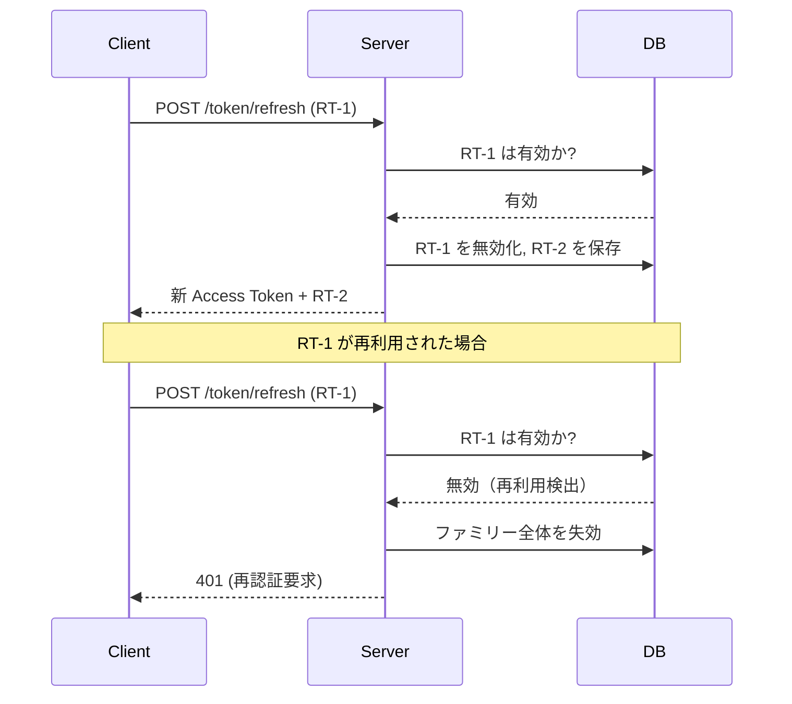

---
tags:
  - investigation
  - jwt
  - authentication
  - express
  - typescript
  - security
---
# Express + TypeScript 環境での JWT 認証ベストプラクティス

## 1. JWT の基本構造

JWT は Header / Payload / Signature の 3 パートをドット区切りで結合した文字列である（[RFC 7519](https://tools.ietf.org/html/rfc7519)）。

- **Header**: 署名アルゴリズム（`alg`）とトークンタイプ（`typ: "JWT"`）を指定する
- **Payload**: クレームを格納する。標準クレームとして `iss`（発行者）, `sub`（主体）, `exp`（有効期限）, `iat`（発行日時）, `jti`（一意識別子）がある
- **Signature**: Base64URL エンコードした Header + Payload を秘密鍵で署名し、改ざん検知を実現する

## 2. 署名アルゴリズムの選択

### 比較表

| アルゴリズム | 種別 | 鍵サイズ | 性能 | 互換性 |
|-------------|------|---------|------|--------|
| HS256 | 対称鍵 | 256bit 共有鍵 | 最速 | 広い |
| RS256 | 非対称鍵 (RSA) | 2048-4096bit | 低速 | 最も広い |
| ES256 | 非対称鍵 (ECDSA) | 256bit EC | 中速 | 広い |
| EdDSA | 非対称鍵 (Ed25519) | 256bit | 高速 | 拡大中 |

**HS256** は署名と検証に同一の秘密鍵を使う対称アルゴリズムで、単一サービス内での利用に適するが、鍵の共有が必要なためマイクロサービス構成では漏洩リスクが高い（[Auth0 Blog: RS256 vs HS256](https://auth0.com/blog/rs256-vs-hs256-whats-the-difference/)）。

**RS256** は秘密鍵で署名し公開鍵で検証する非対称アルゴリズムで、最も広くサポートされている。鍵漏洩時に署名鍵のみのローテーションで対応可能である（[SuperTokens: RS256 vs HS256](https://supertokens.com/blog/rs256-vs-hs256)）。

**ES256** は楕円曲線暗号ベースで、256bit の EC 鍵が 3072bit の RSA 鍵と同等のセキュリティを提供する（[Scott Brady: JWT Signing Algorithms](https://www.scottbrady.io/jose/jwts-which-signing-algorithm-should-i-use)）。

**EdDSA (Ed25519)** は最新かつ最もセキュアで、パフォーマンスも優秀とされる（[Curity: JWT Best Practices](https://curity.io/resources/learn/jwt-best-practices/)）。

### 推奨

- 新規プロジェクト: **ES256** または **EdDSA**
- 広い互換性が必要な場合: **RS256**
- 許可アルゴリズムはホワイトリスト方式で明示的に定義し、algorithm confusion 攻撃を防ぐ（[PortSwigger: Algorithm Confusion](https://portswigger.net/web-security/jwt/algorithm-confusion)）

## 3. Access Token / Refresh Token 戦略

### トークンの役割

| トークン | 有効期限 | 用途 | 検証方式 |
|----------|---------|------|---------|
| Access Token | 短期（15分程度） | API リクエスト認証 | ステートレス |
| Refresh Token | 長期（7-30日） | Access Token 再発行 | サーバー側管理 |

### 保存場所の比較

| 保存場所 | XSS 耐性 | CSRF 耐性 | 永続性 | 推奨用途 |
|----------|----------|----------|--------|---------|
| localStorage | 低（JS アクセス可） | 高 | 高 | 非推奨 |
| httpOnly Cookie | 高（JS アクセス不可） | 低（別途対策要） | 高 | Refresh Token |
| メモリ | 最高 | 最高 | なし | Access Token |

localStorage は XSS 攻撃で容易にトークンを窃取されるため、セキュリティ上非推奨である（[CyberChief: Secure JWT Token Storage](https://www.cyberchief.ai/2023/05/secure-jwt-token-storage.html)）。

### 推奨: ハイブリッド戦略

Access Token をメモリ（変数/state）に保持し、Refresh Token を `httpOnly + Secure + SameSite` Cookie に格納する方式が、XSS/CSRF 双方に対して最も安全である（[WorkOS: Secure JWT Storage](https://workos.com/blog/secure-jwt-storage)）。

```
Access Token 期限切れ → Refresh Token (Cookie) で /token/refresh を呼ぶ → 新 Access Token をメモリに格納
```

## 4. ライブラリ選択

### 比較表

| ライブラリ | 週間 DL | TypeScript | API スタイル | 推奨度 |
|-----------|---------|-----------|-------------|--------|
| jose | 3,750万 | ネイティブ対応 | async/await | 新規で第一選択 |
| jsonwebtoken | 3,250万 | @types で追加 | callback | レガシー向け |
| passport-jwt | 240万 | @types で追加 | Passport strategy | Passport 利用時 |
| express-jwt | 62万 | 型定義あり | middleware | 簡易用途 |

**jose** は Web Crypto API ベースのモダン実装で、TypeScript ファースト、async/await ネイティブ対応、ESM 完全対応であり、新規プロジェクトでの第一選択肢である（[DEV Community: Why You Should Delete jsonwebtoken in 2025](https://dev.to/silentwatcher_95/why-you-should-delete-jsonwebtoken-in-2025-1o7n)）。

**jsonwebtoken** は最も広く使われてきたが、callback ベースの API でメンテナンス頻度が低下傾向にある。新規では jose への移行が推奨される（[Medium: Jose vs Jsonwebtoken](https://joodi.medium.com/jose-vs-jsonwebtoken-why-you-should-switch-4f50dfa3554c)）。

## 5. ミドルウェア設計パターン

### 認証と認可の分離

認証（Authentication）と認可（Authorization）を別々のミドルウェアに分離することで、関心の分離と再利用性を実現する（[Auth0: Secure an Express API](https://auth0.com/blog/node-js-and-typescript-tutorial-secure-an-express-api/)）。

```typescript
// 認証ミドルウェア: トークン検証
import { jwtVerify } from 'jose';

const authenticate = async (req: Request, res: Response, next: NextFunction) => {
  const token = req.headers.authorization?.replace('Bearer ', '');
  if (!token) return res.status(401).json({ error: 'Token required' });

  try {
    const { payload } = await jwtVerify(token, secret);
    req.user = payload as AuthUser;
    next();
  } catch {
    res.status(401).json({ error: 'Invalid token' });
  }
};

// 認可ミドルウェア: RBAC
const authorize = (...roles: Role[]) => {
  return (req: Request, res: Response, next: NextFunction) => {
    if (!roles.includes(req.user.role)) {
      return res.status(403).json({ error: 'Forbidden' });
    }
    next();
  };
};

// 適用順序: authenticate → authorize → handler
app.get('/admin', authenticate, authorize('admin'), adminHandler);
```

### 型安全なリクエスト拡張

Express の Request 型を拡張して、認証済みリクエストに型安全にアクセスする（[DEV Community: JWT Authentication in TypeScript](https://dev.to/julienachmias/authentication-with-jwt-tokens-in-typescript-with-express-3gb1)）。

```typescript
interface AuthUser {
  sub: string;
  email: string;
  role: Role;
}

// グローバル型拡張
declare global {
  namespace Express {
    interface Request {
      user?: AuthUser;
    }
  }
}

// 認証済みリクエスト（user が必須）
interface AuthenticatedRequest extends Request {
  user: AuthUser;
}
```

### エラーハンドリング

| 状況 | HTTP ステータス | クライアント側の対応 |
|------|---------------|-------------------|
| トークンなし / 不正 | 401 Unauthorized | ログイン画面へ遷移 |
| トークン期限切れ | 401 Unauthorized | Refresh Token で再取得 |
| 権限不足 | 403 Forbidden | エラー表示 |

## 6. セキュリティ対策

### トークン失効

JWT はステートレスのため、発行後の失効にはサーバー側の仕組みが必要である（[JWT.app: JWT Best Practices](https://jwt.app/blog/jwt-best-practices/)）。

- **ブラックリスト**: Redis に失効トークンの `jti` を保存し、TTL をトークン残存期限に設定する
- **シークレットローテーション**: JWKS エンドポイントを用いて署名鍵を定期的にローテーションする
- **イベント駆動**: Redis Pub/Sub 等で失効イベントをリアルタイム伝播する

### Refresh Token Rotation

Refresh Token 使用時に新トークンを発行し旧トークンを無効化する。再利用を検出した場合はトークンファミリー全体を失効させる（[NanoGPT: JWT Refresh Tokens Rotation](https://nano-gpt.com/blog/jwt-refresh-tokens-rotation-revocation)）。



### CSRF / XSS 防御

**CSRF 対策**: httpOnly Cookie を使う場合は `SameSite: 'Strict'` を設定し、状態変更操作には CSRF トークンを併用する（[OWASP: CSRF Prevention Cheat Sheet](https://cheatsheetseries.owasp.org/cheatsheets/Cross-Site_Request_Forgery_Prevention_Cheat_Sheet.html)）。

**XSS 対策**: httpOnly Cookie で JS からのトークンアクセスを遮断し、CSP ヘッダーでインラインスクリプト実行を制限する（[APIsec: JWT Security Vulnerabilities](https://www.apisec.ai/blog/jwt-security-vulnerabilities-prevention)）。

### レート制限

ログインおよびトークン更新エンドポイントに `express-rate-limit` でレート制限を適用し、ブルートフォース攻撃を防止する（未検証）。

## 7. 推奨構成まとめ

| 項目 | 推奨 |
|------|------|
| ライブラリ | jose |
| 署名アルゴリズム | ES256（互換性重視なら RS256） |
| Access Token 保存 | メモリ |
| Refresh Token 保存 | httpOnly + Secure + SameSite Cookie |
| Access Token 有効期限 | 15分 |
| Refresh Token 有効期限 | 7-30日 |
| 失効管理 | Redis ブラックリスト + Refresh Token Rotation |
| CSRF 対策 | SameSite Cookie + CSRF Token |
| XSS 対策 | httpOnly Cookie + CSP |
| レート制限 | express-rate-limit |
