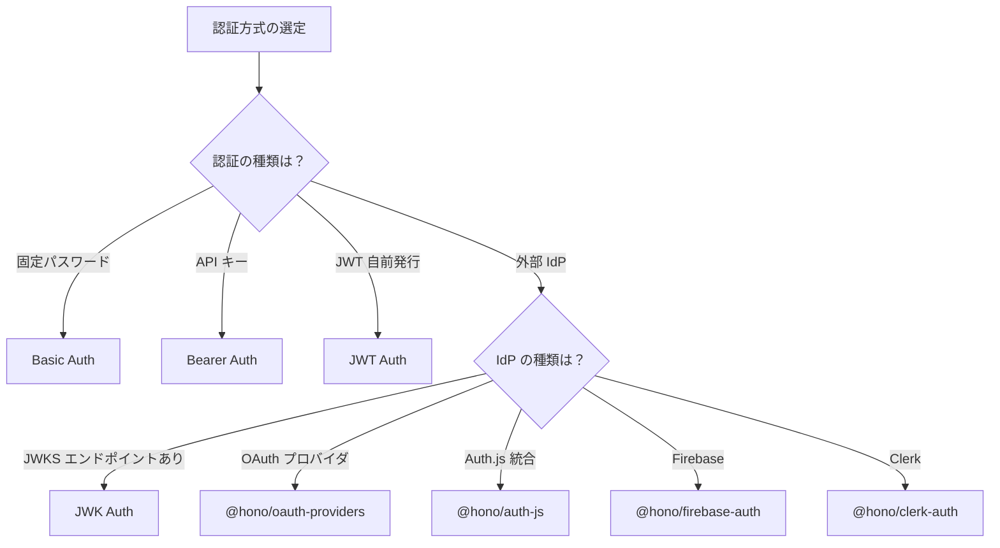

---
tags:
  - research
  - hono
  - authentication
  - middleware
---
# Hono 認証ミドルウェア調査

## ビルトイン認証ミドルウェア

Hono v4 はビルトインで 4 種類の認証ミドルウェアを提供する（[Hono Middleware Guide](https://hono.dev/docs/guides/middleware)）。

### Basic Auth

HTTP Basic 認証を提供する最もシンプルなミドルウェア（[公式ドキュメント](https://hono.dev/docs/middleware/builtin/basic-auth)）。

```ts
import { basicAuth } from 'hono/basic-auth'
```

- ユーザー名/パスワードのペアで認証する
- `verifyUser` コールバックによるカスタム検証が可能
- `onAuthSuccess` で認証成功後の処理（Context への値設定等）を追加できる
- 複数ユーザーの定義に対応
- パスワードは Base64 エンコードのみで暗号化されないため HTTPS が必須（[公式ドキュメント](https://hono.dev/docs/middleware/builtin/basic-auth)）

### Bearer Auth

Bearer トークンによる認証。API キー認証に適する（[公式ドキュメント](https://hono.dev/docs/middleware/builtin/bearer-auth)）。

```ts
import { bearerAuth } from 'hono/bearer-auth'
```

- `token` オプションに文字列または文字列配列を指定
- `verifyToken` コールバックで動的なトークン検証が可能
- エラーレスポンスのカスタマイズ（`noAuthenticationHeader`, `invalidAuthenticationHeader`, `invalidToken`）に対応
- トークンは正規表現 `/[A-Za-z0-9._~+/-]+=*/` にマッチする必要がある（[公式ドキュメント](https://hono.dev/docs/middleware/builtin/bearer-auth)）

### JWT Auth

JWT トークンの検証による認証（[公式ドキュメント](https://hono.dev/docs/middleware/builtin/jwt)）。

```ts
import { jwt } from 'hono/jwt'
import type { JwtVariables } from 'hono/jwt'
```

- `secret`（必須）と `alg`（必須）を指定
- 対応アルゴリズム: HS256, HS384, HS512, RS256, RS384, RS512, PS256, PS384, PS512, ES256, ES384, ES512, EdDSA（[公式ドキュメント](https://hono.dev/docs/middleware/builtin/jwt)）
- `cookie` オプションで Cookie からのトークン取得に対応
- `verifyOptions` で `iss`（発行者）, `nbf`, `iat`, `exp` の検証を制御
- 検証済みペイロードは `c.get('jwtPayload')` で取得

ヘルパー関数として `sign`, `verify`, `decode` も提供される（[JWT Helper](https://hono.dev/docs/helpers/jwt)）。

### JWK Auth

JWK（JSON Web Key）を用いたトークン検証。外部 IdP（Auth0, Cognito 等）との連携に適する（[公式ドキュメント](https://hono.dev/docs/middleware/builtin/jwk)）。

```ts
import { jwk } from 'hono/jwk'
```

- `alg`（必須）に非対称アルゴリズムの配列を指定
- `jwks_uri` で JWKS エンドポイントからの動的キー取得に対応
- `keys` で静的な公開鍵の指定も可能
- `allow_anon` オプションで未認証リクエストの通過を許可
- JWT の `kid` ヘッダーが必須（[公式ドキュメント](https://hono.dev/docs/middleware/builtin/jwk)）

## ビルトインミドルウェア比較

| ミドルウェア | ユースケース | トークン形式 | 複雑さ |
|---|---|---|---|
| Basic Auth | 管理画面、内部ツール、簡易保護 | ユーザー名:パスワード（Base64） | 低 |
| Bearer Auth | API キー認証、静的トークン | 任意文字列 | 低 |
| JWT Auth | ステートレスセッション、自前 JWT 発行 | JWT（対称・非対称） | 中 |
| JWK Auth | 外部 IdP 連携（Auth0, Cognito 等） | JWT + JWKS エンドポイント | 中〜高 |

全ミドルウェアに共通する API パターン（[Hono Middleware Guide](https://hono.dev/docs/guides/middleware)）:
- `app.use('/path/*', middleware(options))` でパス単位の保護
- 個別ルートハンドラへの直接適用も可能
- Authorization ヘッダーがデフォルトのトークンソース

### カスタマイズ性の比較

| 機能 | Basic Auth | Bearer Auth | JWT Auth | JWK Auth |
|---|---|---|---|---|
| カスタム検証 | `verifyUser` | `verifyToken` | - | - |
| Cookie 対応 | - | - | `cookie` | `cookie` |
| カスタムヘッダー | - | `headerName` | `headerName` | `headerName` |
| エラーカスタマイズ | `invalidUserMessage` | 3 種の error object | - | - |
| 成功コールバック | `onAuthSuccess` | - | - | - |
| 匿名アクセス許可 | - | - | - | `allow_anon` |

## サードパーティ認証ミドルウェア

Hono は `@hono/` 名前空間で多数のサードパーティ認証ミドルウェアを提供している（[Third-party Middleware 一覧](https://hono.dev/docs/middleware/third-party)）。

| ミドルウェア | パッケージ | 概要 |
|---|---|---|
| Auth.js (NextAuth) | `@hono/auth-js` | Auth.js セッションを Context に注入。OAuth プロバイダ対応 |
| Clerk Auth | `@hono/clerk-auth` | Clerk ユーザー管理・認証プラットフォーム連携 |
| Firebase Auth | `@hono/firebase-auth` | Firebase Authentication 連携 |
| OAuth Providers | `@hono/oauth-providers` | 各種 OAuth プロバイダとの認証連携 |
| OIDC Auth | `@hono/oidc-auth` | OpenID Connect ベースの認証 |
| Cloudflare Access | `@hono/cloudflare-access` | Cloudflare Access による認証・認可 |
| Casbin | `@hono/casbin` | RBAC / ABAC アクセス制御（認可） |
| Stytch Auth | `@hono/stytch-auth` | パスワードレス認証プラットフォーム連携 |

### Auth.js 連携

`@hono/auth-js` は Auth.js（旧 NextAuth.js）のセッション管理を Hono に統合する（[npm: @hono/auth-js](https://www.npmjs.com/package/@hono/auth-js)）。

- OAuth プロバイダ（GitHub, Google 等）の設定が可能
- コールバック URL: `{server}/api/auth/callback/{provider}`
- クライアントサイドは現時点で React のみ公式対応（[npm: @hono/auth-js](https://www.npmjs.com/package/@hono/auth-js)）

### Firebase Auth 連携

- `@hono/firebase-auth`: 公式パッケージだが Cloudflare Workers のみ公式サポート（[npm: @hono/firebase-auth](https://www.npmjs.com/package/@hono/firebase-auth)）
- `@fiboup/hono-firebase-auth`: コミュニティパッケージで、より広いランタイムに対応（[npm: @fiboup/hono-firebase-auth](https://www.npmjs.com/package/@fiboup/hono-firebase-auth)）

### Better Auth 連携

Better Auth フレームワークも Hono との統合ガイドを提供している（[Better Auth - Hono Integration](https://better-auth.com/docs/integrations/hono)）。

## 選定ガイド


