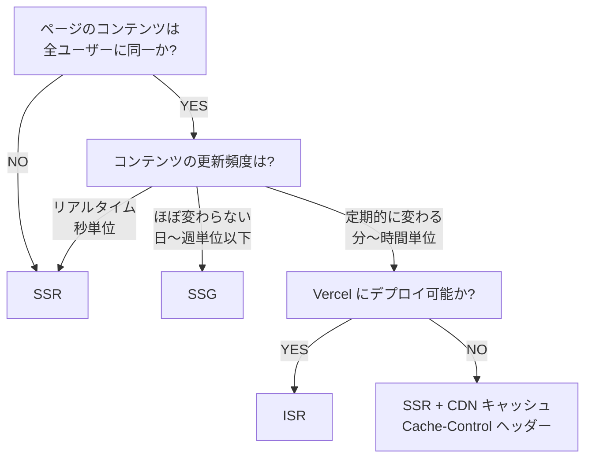

---
tags:
  - research
  - sveltekit
  - ssr
  - ssg
  - isr
  - rendering
---
# SvelteKit の SSR / SSG / ISR 使い分け

## 各戦略の仕組み

### SSR (Server-Side Rendering)

リクエストごとにサーバーで HTML を生成する方式。SvelteKit のデフォルト動作であり、初回ロードを SSR で処理した後、以降のナビゲーションは CSR（クライアントサイドレンダリング）に切り替わる「transitional app」モデルを採用している（[SvelteKit Docs - Project types](https://svelte.dev/docs/kit/project-types)）。

SSR は SEO に有利で、検索エンジンが完全な HTML をクロールできる。SPA で必要となる追加のラウンドトリップを回避し、パフォーマンスを向上させる（[SvelteKit Docs - Glossary](https://svelte.dev/docs/kit/glossary)）。一方、リクエストのたびにサーバー処理が発生するため、TTFB はサーバー負荷に依存し、常時稼働するサーバーが必要になる。

### SSG (Static Site Generation)

ビルド時に全ページの HTML を事前生成する方式。SvelteKit では `prerender = true` をページ単位で設定するか、`adapter-static` で全ページを一括プリレンダリングする（[SvelteKit Docs - Page options](https://svelte.dev/docs/kit/page-options)）。

生成済み HTML を CDN から配信するため TTFB が最速で、サーバーが不要なためホスティングコストも最低限になる（[SvelteKit Docs - Project types](https://svelte.dev/docs/kit/project-types)）。ただしコンテンツ更新のたびにビルド・デプロイが必要で、大規模サイトではビルド時間が問題になりうる。SvelteKit 公式は「SvelteKit は SSG 専用ツールではないため、非常に大量のページでは専用 SSG ツールほどスケールしない可能性がある」と注記している（[SvelteKit Docs - Project types](https://svelte.dev/docs/kit/project-types)）。

### ISR (Incremental Static Regeneration)

初回リクエスト時に静的ページを生成・キャッシュし、設定した有効期限（expiration）後にバックグラウンドで再生成する方式。SSG の配信速度と SSR のデータ鮮度を両立するハイブリッド手法である（[SvelteKit Docs - Adapter Vercel](https://svelte.dev/docs/kit/adapter-vercel)）。

SvelteKit では **adapter-vercel 限定**の機能であり、`config.isr` オブジェクトで設定する。`bypassToken` による on-demand revalidation にも対応している（[SvelteKit Docs - Adapter Vercel](https://svelte.dev/docs/kit/adapter-vercel)）。

## SvelteKit での設定方法

### ページオプション

`+page.js` / `+page.ts` / `+page.server.js` / `+page.server.ts` から export する。`+layout.js` / `+layout.ts` でも設定可能で、配下の全ページに適用される（[SvelteKit Docs - Page options](https://svelte.dev/docs/kit/page-options)）。

#### SSR（デフォルトで有効）

```ts
// +page.ts
export const ssr = true;  // デフォルト（省略可）
export const ssr = false; // SSR を無効化（空の HTML シェルを返す）
```

`ssr = false` にすると空のシェルが返り JS でクライアント描画する。SEO・アクセシビリティに悪影響があるため、公式は非推奨としている（[SvelteKit Docs - Page options](https://svelte.dev/docs/kit/page-options)）。

#### SSG（prerender）

```ts
// +page.ts
export const prerender = true;   // ビルド時に HTML 生成
export const prerender = false;  // 動的 SSR のみ
export const prerender = 'auto'; // prerender と SSR の両方で利用可能
```

`prerender = true` のルートは動的 SSR マニフェストから除外され、サーバーバンドルが軽量化される（[SvelteKit Docs - Page options](https://svelte.dev/docs/kit/page-options)）。

#### CSR

```ts
// +page.ts
export const csr = false; // JS ハイドレーションを無効化
```

`csr = false` で JS を一切送信しない完全静的 HTML になる。フォームのプログレッシブエンハンスメントや SPA ナビゲーションは不可になる（[SvelteKit Docs - Page options](https://svelte.dev/docs/kit/page-options)）。

#### ISR（adapter-vercel 限定）

```ts
// +page.server.ts
export const config = {
  isr: {
    expiration: 60,                    // 秒単位のキャッシュ有効期限（必須）
    bypassToken: 'your-32char-token',  // on-demand revalidation 用（任意）
    allowQuery: ['search']             // キャッシュキーに含める query パラメータ（任意）
  }
};
```

- `expiration: false` でキャッシュを無期限にできる（bypass token と組み合わせて手動更新）
- `prerender = true` のルートでは ISR 設定は無視される
- ユーザー固有データのあるページには使わない（キャッシュがリークする）

（[SvelteKit Docs - Adapter Vercel](https://svelte.dev/docs/kit/adapter-vercel)）

### アダプター別の対応状況

| アダプター | SSR | SSG | ISR | 主な用途 |
|-----------|:---:|:---:|:---:|----------|
| adapter-node | o | o | x | 自前サーバー / Docker |
| adapter-vercel | o | o | o | Serverless + Edge |
| adapter-netlify | o | o | x | Serverless + Edge |
| adapter-cloudflare | o | o | x | Cloudflare Workers |
| adapter-static | x | o | x | 純粋な静的サイト |

（[SvelteKit Docs - Project types](https://svelte.dev/docs/kit/project-types)、[SvelteKit Docs - Adapter Vercel](https://svelte.dev/docs/kit/adapter-vercel)）

## ユースケースとトレードオフ

### SSR が適するケース

- ユーザーごとにパーソナライズされるページ（ダッシュボード、マイページ）
- リアルタイム性が求められるページ（EC の在庫、検索結果）
- SEO が重要かつコンテンツが頻繁に変わるページ
- 認証状態に依存するページ

（[SvelteKit Docs - Glossary](https://svelte.dev/docs/kit/glossary)、[SSR vs SSG vs ISR vs PPR: Rendering 2026](https://www.pkgpulse.com/blog/ssr-vs-ssg-vs-isr-vs-ppr-rendering-2026)）

### SSG が適するケース

- ドキュメントサイト、ブログ、マーケティングページ、LP
- ヘルプセンター、FAQ
- 全ユーザーに同一コンテンツを表示し、更新頻度が低いページ

（[SvelteKit Docs - Project types](https://svelte.dev/docs/kit/project-types)）

### ISR が適するケース

- ニュースサイト、ブログ（定期更新だが全ユーザーに同一内容）
- EC の商品カタログ（数分〜数時間おきの更新）
- 大規模サイトでビルド時間を短縮したい場合

（[SvelteKit Docs - Adapter Vercel](https://svelte.dev/docs/kit/adapter-vercel)、[SSR vs SSG vs ISR vs PPR: Rendering 2026](https://www.pkgpulse.com/blog/ssr-vs-ssg-vs-isr-vs-ppr-rendering-2026)）

### トレードオフ比較

| 観点 | SSR | SSG | ISR |
|------|-----|-----|-----|
| TTFB | 中（サーバー処理） | 最速（CDN 配信） | 速い（キャッシュヒット時） |
| データ鮮度 | 常に最新 | ビルド時点 | expiration 間隔 |
| SEO | 良好 | 最良 | 良好 |
| サーバー負荷 | 高 | なし | 低（キャッシュミス時のみ） |
| ビルド時間 | なし | ページ数に比例 | 初回リクエスト時のみ |
| ホスティングコスト | 中〜高 | 最低 | 低〜中 |
| パーソナライズ | 可能 | 不可 | 不可 |
| インフラ制約 | なし | なし | Vercel 限定 |

## 選定フロー



### 判断軸の補足

- **パーソナライズ要否**: ユーザー固有データが必要なら SSR 一択。共通コンテンツ + 小さなユーザー固有パーツなら SSG/ISR + クライアントサイド fetch も選択肢になる（未検証）
- **ページ数とビルド規模**: 数千ページまでなら SSG で問題ない。万単位なら ISR でビルド時間を回避するか SSR を検討する（[SvelteKit Docs - Adapter Vercel](https://svelte.dev/docs/kit/adapter-vercel)）
- **SEO 要件**: SSR / SSG / ISR いずれも SEO に有効。管理画面など SEO 不要なページは `ssr = false` の CSR のみでも可（[SvelteKit Docs - Page options](https://svelte.dev/docs/kit/page-options)）
- **インフラ制約**: ISR は Vercel 限定。他環境では SSR + CDN キャッシュ（Cache-Control ヘッダー）で近似可能（[Rich Harris explains why SvelteKit pushes for SSR](https://dev.to/mandrasch/rich-harris-explains-why-sveltekit-pushes-for-server-side-rendering-and-against-spa-5flj)）

## SvelteKit ならではのポイント

- **ページ単位で混在可能**: マーケティングページは SSG、動的ページは SSR、管理画面は CSR のみ、というハイブリッド構成を1つのプロジェクトで実現できる（[SvelteKit Docs - Project types](https://svelte.dev/docs/kit/project-types)）
- **デフォルトは SSR**: 何も設定しなければ SSR + CSR のハイブリッド（transitional app）として動作する（[SvelteKit Docs - Project types](https://svelte.dev/docs/kit/project-types)）
- **ISR は Vercel 限定**: adapter-vercel の `config.isr` でのみ利用可能。他のアダプターでは SSR + CDN キャッシュで代替する（[SvelteKit Docs - Adapter Vercel](https://svelte.dev/docs/kit/adapter-vercel)）
