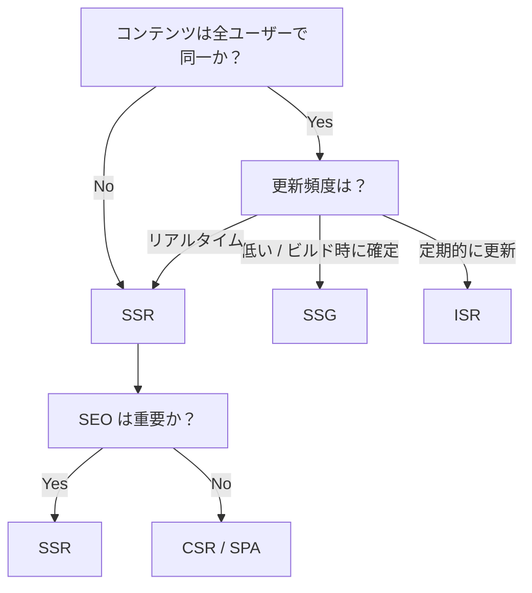

---
tags:
  - research
  - sveltekit
  - ssr
  - ssg
  - isr
  - rendering
  - performance
---
# SvelteKit レンダリング戦略調査

## 1. レンダリング戦略の概要

SvelteKit はルート単位で SSR / SSG / ISR / SPA を混在させることができる。マーケティングページをプリレンダリングし、動的ページを SSR し、管理画面を SPA にするといったハイブリッド構成が同一アプリ内で可能（[SvelteKit 公式 — Page options](https://svelte.dev/docs/kit/page-options)）。子ルートが親レイアウトの設定を上書きできるため、レイアウト階層で柔軟に戦略を切り替えられる（[SvelteKit 公式 — Page options](https://svelte.dev/docs/kit/page-options)）。

## 2. 各戦略の仕組みと設定方法

### 2.1 SSR（Server-Side Rendering）

SvelteKit のデフォルトでは SSR が有効（`ssr = true`）で、リクエストごとにサーバー上で HTML を生成しクライアントに返す（[SvelteKit 公式 — Page options](https://svelte.dev/docs/kit/page-options)）。

`export const ssr = false;` で無効化でき、クライアント側のみでレンダリングする SPA 的挙動になる。ルートレイアウトで `ssr = false` にするとアプリ全体が SPA になるが、公式は「not recommended」としている（[SvelteKit 公式 — Page options](https://svelte.dev/docs/kit/page-options)）。

**Load 関数の実行順序:**

1. Server load 関数（`+page.server.js`）が最初に実行される
2. Universal load 関数（`+page.js`）がサーバー上で実行される（SSR の fetch レスポンスを再利用）
3. Hydration 時にブラウザで universal load が再実行される（キャッシュされた fetch データを使用）

（[SvelteKit 公式 — Load](https://svelte.dev/docs/kit/load)）

Server load は `cookies`、`locals`、`clientAddress`、`platform`、`request` にアクセス可能で、DB アクセスや機密処理に使う。Universal load は認証不要な外部 API fetch や非シリアライズ可能オブジェクトの返却に使う（[SvelteKit 公式 — Load](https://svelte.dev/docs/kit/load)）。

### 2.2 CSR（Client-Side Rendering / Hydration）

デフォルトで有効（`csr = true`）。サーバーで生成された HTML をクライアントで hydrate し、インタラクティブにする（[SvelteKit 公式 — Page options](https://svelte.dev/docs/kit/page-options)）。

`export const csr = false;` で無効化すると、JS がクライアントに送信されず、フォームの progressive enhancement が無効になり、リンクがフルページナビゲーションになる。インタラクティビティ不要なページ（ブログ記事等）で有効（[SvelteKit 公式 — Page options](https://svelte.dev/docs/kit/page-options)）。

開発時だけ CSR を有効にするパターン: `import { dev } from '$app/environment'; export const csr = dev;`（[SvelteKit 公式 — Page options](https://svelte.dev/docs/kit/page-options)）。

### 2.3 SSG（Static Site Generation / Prerendering）

ビルド時にページの内容を計算し HTML として保存する。リクエストごとの再計算が不要で、CDN から配信でき TTFB に優れる（[SvelteKit 公式 — Glossary: Prerendering](https://svelte.dev/docs/kit/glossary#Prerendering)）。

**設定方法:**

- `export const prerender = true;` でルートごとに指定（[SvelteKit 公式 — Page options](https://svelte.dev/docs/kit/page-options)）
- `prerender = 'auto'` にすると、プリレンダリングしつつ SSR マニフェストにも残す（動的サーバーレンダリングも可能）（[SvelteKit 公式 — Page options](https://svelte.dev/docs/kit/page-options)）
- 動的ルートのプリレンダリングには `entries()` 関数でエントリーポイントを指定する（[SvelteKit 公式 — Page options](https://svelte.dev/docs/kit/page-options)）

**全ページ SSG（adapter-static）:**

adapter-static はアプリ全体を静的ファイルとしてプリレンダリングする。ルートの `+layout.js` に `export const prerender = true;` を追加する必要がある（[SvelteKit 公式 — adapter-static](https://svelte.dev/docs/kit/adapter-static)）。

```js
import adapter from '@sveltejs/adapter-static';
export default {
  kit: {
    adapter: adapter({
      pages: 'build',
      assets: 'build',
      fallback: undefined,
      precompress: false,
      strict: true
    })
  }
};
```
（[SvelteKit 公式 — adapter-static](https://svelte.dev/docs/kit/adapter-static)）

**制約:**

- 全ユーザーに同一コンテンツを返すページでなければならない（[SvelteKit 公式 — Glossary: Prerendering](https://svelte.dev/docs/kit/glossary#Prerendering)）
- form actions を持つページはプリレンダリング不可（POST 処理が必要なため）（[SvelteKit 公式 — Page options](https://svelte.dev/docs/kit/page-options)）
- `url.searchParams` に依存するコンテンツはプリレンダリング時に禁止（[SvelteKit 公式 — Page options](https://svelte.dev/docs/kit/page-options)）
- コンテンツの更新には新たなビルドとデプロイが必要（[SvelteKit 公式 — Glossary: Prerendering](https://svelte.dev/docs/kit/glossary#Prerendering)）
- `ssr = false` のページはプリレンダリングできない（空の HTML シェルしか生成されない）（[SvelteKit 公式 — adapter-static](https://svelte.dev/docs/kit/adapter-static)）

### 2.4 ISR（Incremental Static Regeneration）

ISR はプリレンダリングのパフォーマンスとコスト面の利点を、動的レンダリングの柔軟性と組み合わせたもの。初回リクエストで SSR し結果をキャッシュ、`expiration` 秒後に次のリクエストでバックグラウンド再生成する（[SvelteKit 公式 — adapter-vercel](https://svelte.dev/docs/kit/adapter-vercel)）。

**SvelteKit では Vercel アダプターのみネイティブ対応**（[SvelteKit 公式 — adapter-vercel](https://svelte.dev/docs/kit/adapter-vercel)）。

**設定方法:**

```js
export const config = {
  isr: {
    expiration: 60,                  // 秒数。キャッシュ再生成までの時間
    bypassToken: BYPASS_TOKEN,       // オンデマンド再生成用トークン（32文字以上）
    allowQuery: ['search']           // キャッシュキーに含めるクエリパラメータ
  }
};
```
（[SvelteKit 公式 — adapter-vercel](https://svelte.dev/docs/kit/adapter-vercel)）

- `expiration`: 必須。`false` にすると無期限キャッシュ（bypassToken でオンデマンド再生成）（[SvelteKit 公式 — adapter-vercel](https://svelte.dev/docs/kit/adapter-vercel)）
- `allowQuery`: UTM パラメータ等による不要な再生成を防止。デフォルトは全クエリパラメータを無視（[SvelteKit 公式 — adapter-vercel](https://svelte.dev/docs/kit/adapter-vercel)）

**制約:**

- `prerender = true` のページでは ISR 設定は無視される（[SvelteKit 公式 — adapter-vercel](https://svelte.dev/docs/kit/adapter-vercel)）
- 全訪問者に同一コンテンツを返すルートにのみ使用すること。ユーザー固有の処理はクライアント側 JS でのみ行うべき（情報漏洩リスク）（[SvelteKit 公式 — adapter-vercel](https://svelte.dev/docs/kit/adapter-vercel)）
- キャッシュリフレッシュサイクル中にユーザーが古いコンテンツを受け取る可能性がある（[Crystallize Blog — Web Rendering Explained](https://crystallize.com/blog/web-rendering)）

## 3. アダプター別の対応状況と制約

### 3.1 adapter-vercel

- SSR: Serverless Functions（デフォルト）または Edge Functions で実行（[SvelteKit 公式 — adapter-vercel](https://svelte.dev/docs/kit/adapter-vercel)）
- SSG: `prerender` オプションで対応（[SvelteKit 公式 — adapter-vercel](https://svelte.dev/docs/kit/adapter-vercel)）
- ISR: ネイティブ対応（[SvelteKit 公式 — adapter-vercel](https://svelte.dev/docs/kit/adapter-vercel)）
- ストリーミング SSR: Edge Runtime で対応。AWS Lambda ベースの Serverless Functions ではストリーミング不可（[SvelteKit Blog — Streaming, snapshots, and other new features](https://svelte.dev/blog/streaming-snapshots-sveltekit)）
- `split` オプションでルートごとに個別の関数をデプロイ可能（[SvelteKit 公式 — adapter-vercel](https://svelte.dev/docs/kit/adapter-vercel)）
- Edge Functions は `fs` モジュール使用不可（[SvelteKit 公式 — adapter-vercel](https://svelte.dev/docs/kit/adapter-vercel)）

**Vercel Functions の制約:**

| 項目 | Hobby | Pro / Enterprise |
|---|---|---|
| バンドルサイズ | 250MB（非圧縮） | 250MB（非圧縮） |
| メモリ | 最大 2GB / 1vCPU | 最大 4GB / 2vCPU |
| 最大実行時間（Fluid Compute） | 300s | 最大 800s |
| 同時実行数 | 最大 30,000 | 100,000+ |
| リクエスト/レスポンスボディ | 4.5MB | 4.5MB |

（[Vercel — Functions Limitations](https://vercel.com/docs/functions/limitations)）

### 3.2 adapter-node

- SSR: スタンドアロン Node.js サーバーを生成。Express / Polka / Node http.createServer にインポート可能（[SvelteKit 公式 — adapter-node](https://svelte.dev/docs/kit/adapter-node)）
- SSG: `prerender` オプションで部分的に対応（[SvelteKit 公式 — Page options](https://svelte.dev/docs/kit/page-options)）
- ISR: 非対応。キャッシュ制御はアプリケーション側やリバースプロキシで自前実装が必要（[SvelteKit 公式 — adapter-node](https://svelte.dev/docs/kit/adapter-node)）
- ストリーミング SSR: 対応。レスポンスはデフォルトでストリーミング配信される（[SvelteKit 公式 — adapter-node](https://svelte.dev/docs/kit/adapter-node)）
- 圧縮はリバースプロキシ層で行うことを推奨（Node.js のシングルスレッド制約のため）（[SvelteKit 公式 — adapter-node](https://svelte.dev/docs/kit/adapter-node)）
- Graceful shutdown 対応: `SHUTDOWN_TIMEOUT`（デフォルト 30 秒）（[SvelteKit 公式 — adapter-node](https://svelte.dev/docs/kit/adapter-node)）

### 3.3 adapter-cloudflare

- SSR: Cloudflare Workers / Pages で実行（[SvelteKit 公式 — adapter-cloudflare](https://svelte.dev/docs/kit/adapter-cloudflare)）
- SSG: `prerender` オプションで部分的に対応（[SvelteKit 公式 — Page options](https://svelte.dev/docs/kit/page-options)）
- ISR: 非対応（[SvelteKit 公式 — adapter-cloudflare](https://svelte.dev/docs/kit/adapter-cloudflare)）
- ストリーミング SSR: エッジランタイムのため対応（[SvelteKit Blog — Streaming, snapshots, and other new features](https://svelte.dev/blog/streaming-snapshots-sveltekit)）
- `platform` オブジェクトで KV、Durable Objects 等にアクセス可能（[SvelteKit 公式 — adapter-cloudflare](https://svelte.dev/docs/kit/adapter-cloudflare)）
- `fs` モジュール使用不可（[SvelteKit 公式 — adapter-cloudflare](https://svelte.dev/docs/kit/adapter-cloudflare)）

**Cloudflare Workers の制約:**

| 項目 | Free | Paid |
|---|---|---|
| スクリプトサイズ（gzip） | 3MB | 10MB |
| CPU 時間 | 10ms/リクエスト | 最大 5 分 |
| メモリ | 128MB/isolate | 128MB/isolate |
| サブリクエスト | 50/リクエスト | 10,000/リクエスト |
| 日次リクエスト | 100,000/日 | 無制限 |

（[Cloudflare Workers — Limits](https://developers.cloudflare.com/workers/platform/limits/)）

Worker バンドルが大きいと起動時間に影響するため、設定や静的ファイルは R2 / KV / Workers Static Assets に外部化することが推奨されている（[Cloudflare Workers — Limits](https://developers.cloudflare.com/workers/platform/limits/)）。

### 3.4 adapter-netlify

- SSR: Serverless Functions（デフォルト）または Deno ベースの Edge Functions（`edge: true`）で実行（[SvelteKit 公式 — adapter-netlify](https://svelte.dev/docs/kit/adapter-netlify)）
- SSG: `prerender` オプションで部分的に対応（[SvelteKit 公式 — Page options](https://svelte.dev/docs/kit/page-options)）
- ISR: 非対応（公式ドキュメントに言及なし）（[SvelteKit 公式 — adapter-netlify](https://svelte.dev/docs/kit/adapter-netlify)）
- Edge Functions は地理的に近い場所で実行されるため動的コンテンツのレイテンシが改善される（[SvelteKit 公式 — adapter-netlify](https://svelte.dev/docs/kit/adapter-netlify)）
- Edge デプロイでは `fs` モジュール使用不可。`split` と `edge` は併用不可（[SvelteKit 公式 — adapter-netlify](https://svelte.dev/docs/kit/adapter-netlify)）
- Netlify Forms はプリレンダリングされた HTML ページが必要（`prerender = true` が必須）（[SvelteKit 公式 — adapter-netlify](https://svelte.dev/docs/kit/adapter-netlify)）

### 3.5 adapter-static

- SSR: 不可（静的ファイルのみ出力）（[SvelteKit 公式 — adapter-static](https://svelte.dev/docs/kit/adapter-static)）
- SSG: 全ページをプリレンダリング（[SvelteKit 公式 — adapter-static](https://svelte.dev/docs/kit/adapter-static)）
- ISR: 不可（[SvelteKit 公式 — adapter-static](https://svelte.dev/docs/kit/adapter-static)）
- `fallback` を指定すると SPA モードとして動作するが、「パフォーマンスと SEO に大きな悪影響がある」と公式が警告している（[SvelteKit 公式 — adapter-static](https://svelte.dev/docs/kit/adapter-static)）
- `strict: true`（デフォルト）で全ページがプリレンダリング済みか検証する（[SvelteKit 公式 — adapter-static](https://svelte.dev/docs/kit/adapter-static)）

### アダプター対応まとめ

| 機能 | adapter-vercel | adapter-node | adapter-cloudflare | adapter-netlify | adapter-static |
|---|---|---|---|---|---|
| SSR | o | o | o | o | x |
| SSG（部分） | o | o | o | o | - |
| SSG（全体） | - | - | - | - | o |
| ISR | o | x | x | x | x |
| ストリーミング SSR | Edge のみ | o | o | Edge のみ | x |
| Edge 実行 | o | x | o | o | x |

## 4. パフォーマンス特性

### 4.1 TTFB 比較

| 戦略 | TTFB | 備考 |
|---|---|---|
| SSG / ISR | 20-50ms | CDN 配信 |
| SSR（ウォーム） | 80-200ms | サーバー処理時間を含む |
| SSR（コールドスタート） | 300-900ms | サーバーレス環境で顕著 |

（[PkgPulse Blog — SSR vs SSG vs ISR vs PPR](https://www.pkgpulse.com/blog/ssr-vs-ssg-vs-isr-vs-ppr-rendering-2026)）

### 4.2 SvelteKit SSR ベンチマーク（6 フレームワーク比較）

テスト条件: Google Lighthouse で 5 回実行し平均値。TTFB は `hey` ツールで 250 リクエスト（同時 1 ワーカー）をローカル送信。全フレームワーク SSR 構成、Tailwind CSS + Enterspeed をコンテンツソースとして使用（[Enterspeed Blog — SSR Performance of 6 JS Frameworks](https://www.enterspeed.com/blog/we-measured-the-ssr-performance-of-6-js-frameworks-heres-what-we-found)）。

| 指標 | SvelteKit | 順位（6 中） |
|---|---|---|
| Lighthouse Performance | 99 | 2 位 |
| FCP | 0.9s | 2 位タイ |
| LCP | 0.9s | 2 位 |
| TBT | 36ms | 5 位 |
| Speed Index | 2.3s | 1 位 |
| TTFB | 62ms | 1 位 |
| CLS | 0 | - |

（[Enterspeed Blog — SSR Performance of 6 JS Frameworks](https://www.enterspeed.com/blog/we-measured-the-ssr-performance-of-6-js-frameworks-heres-what-we-found)）

### 4.3 SvelteKit 組み込みの最適化

SvelteKit は以下の最適化を自動的に行う（[SvelteKit 公式 — Performance](https://svelte.dev/docs/kit/performance)）:

- **コード分割**: 現在のページに必要なコードのみがロードされる
- **アセットプリロード**: ファイルが別のファイルをリクエストするウォーターフォールを防止
- **ファイルハッシュ**: アセットの永続キャッシュを有効化
- **リクエスト結合**: 複数のサーバー load 関数からのデータを単一の HTTP リクエストにまとめる
- **並列ロード**: 独立した universal load 関数を同時実行
- **データインライン化**: SSR 中の fetch リクエストをブラウザで再実行せずリプレイする

Vite のコード分割は多数の小ファイルを生成するため、最適なパフォーマンスには HTTP/2 以上が必要（[SvelteKit 公式 — Performance](https://svelte.dev/docs/kit/performance)）。

### 4.4 ストリーミング SSR

`load` 関数で Promise を await せずに返すことで、結果をクライアントにストリーミング配信できる。サーバーが全データを待つブロッキングウォーターフォールを排除する（[SvelteKit.io — Make your SvelteKit app faster](https://sveltekit.io/blog/make-your-sveltekit-app-faster)）。

ストリーミングの制約: AWS Lambda ベースのプラットフォーム（サーバーレス関数等）はストリーミングをサポートしない。従来型の Node.js サーバーやエッジベースのランタイムはサポートする（[SvelteKit Blog — Streaming, snapshots, and other new features](https://svelte.dev/blog/streaming-snapshots-sveltekit)）。

## 5. ユースケース別選定基準

### 5.1 選定の判断軸

Vercel が提示する 5 つの判断軸（[Vercel Blog — How to choose the best rendering strategy](https://vercel.com/blog/how-to-choose-the-best-rendering-strategy-for-your-app)）:

1. **コンテンツ更新頻度**: 静的コンテンツ -> SSG、定期更新 -> ISR、リアルタイムデータ -> SSR/CSR
2. **SEO 要件**: 検索可視性が重要なページは静的またはサーバーレンダリングを優先（Core Web Vitals がランキングに影響）
3. **ユーザーインタラクションレベル**: 少ない -> SSG/ISR + 軽量 JS、多い -> SSR + クライアントハイドレーション or CSR
4. **読み込み速度要件**: 最速 -> SSG or 低頻度 ISR、鮮度とスピードのバランス -> ISR or SSR
5. **パーソナライズ**: 必要 -> SSR or CSR。SSG ではパーソナライズ不可

### 5.2 選定フローチャート



（[PkgPulse Blog — SSR vs SSG vs ISR vs PPR](https://www.pkgpulse.com/blog/ssr-vs-ssg-vs-isr-vs-ppr-rendering-2026) を基に構成）

### 5.3 戦略別の推奨ユースケース

**SSG が適するケース:**

- 静的ブログ、ドキュメントサイト（[This Dot Labs — Deep Dive into SvelteKit's Rendering](https://www.thisdot.co/blog/a-deep-dive-into-sveltekits-rendering-techniques)）
- マーケティングランディングページ（[Vercel Blog](https://vercel.com/blog/how-to-choose-the-best-rendering-strategy-for-your-app)）
- ポートフォリオサイト（[PkgPulse Blog](https://www.pkgpulse.com/blog/ssr-vs-ssg-vs-isr-vs-ppr-rendering-2026)）
- パーソナライズ不要で更新頻度の低い商品リスト（[Crystallize Blog](https://crystallize.com/blog/web-rendering)）

**ISR が適するケース:**

- EC 商品カタログ（価格・在庫の定期更新）（[PkgPulse Blog](https://www.pkgpulse.com/blog/ssr-vs-ssg-vs-isr-vs-ppr-rendering-2026)）
- ニュースサイト（毎時の記事更新）（[PkgPulse Blog](https://www.pkgpulse.com/blog/ssr-vs-ssg-vs-isr-vs-ppr-rendering-2026)）
- 大規模コンテンツサイト（フルリビルドが非現実的な規模）（[Vercel Blog](https://vercel.com/blog/how-to-choose-the-best-rendering-strategy-for-your-app)）
- CMS ベースのドキュメント（コンテンツチームが定期公開）（[PkgPulse Blog](https://www.pkgpulse.com/blog/ssr-vs-ssg-vs-isr-vs-ppr-rendering-2026)）

**SSR が適するケース:**

- パーソナライズされたダッシュボード、認証付きページ（[Vercel Blog](https://vercel.com/blog/how-to-choose-the-best-rendering-strategy-for-your-app)）
- EC のチェックアウトフロー（正確なカート状態が必要）（[PkgPulse Blog](https://www.pkgpulse.com/blog/ssr-vs-ssg-vs-isr-vs-ppr-rendering-2026)）
- リアルタイムデータ可視化（ライブスコア、秒単位で変わる価格）（[PkgPulse Blog](https://www.pkgpulse.com/blog/ssr-vs-ssg-vs-isr-vs-ppr-rendering-2026)）
- 検索結果ページ（クエリパラメータ駆動）（[PkgPulse Blog](https://www.pkgpulse.com/blog/ssr-vs-ssg-vs-isr-vs-ppr-rendering-2026)）
- 動的コンテンツを持つ SEO 依存アプリ（[This Dot Labs](https://www.thisdot.co/blog/a-deep-dive-into-sveltekits-rendering-techniques)）

**CSR / SPA が適するケース:**

- 管理パネル、内部ツール（SEO 不要、インタラクティビティ必須）（[This Dot Labs](https://www.thisdot.co/blog/a-deep-dive-into-sveltekits-rendering-techniques)）
- ネイティブソフトウェアに近いアプリ（Figma, Spotify, Google Drive のような複雑な UI）（[DEV Community — Rich Harris explains why SvelteKit pushes for SSR](https://dev.to/mandrasch/rich-harris-explains-why-sveltekit-pushes-for-server-side-rendering-and-against-spa-5flj)）
- 別バックエンドがある場合やバックエンド不要な場合（[SvelteKit 公式 — Project types](https://svelte.dev/docs/kit/project-types)）

### 5.4 戦略別パフォーマンス比較

| 指標 | SSG | ISR | SSR | CSR |
|---|---|---|---|---|
| TTFB | 最速 | 最速 | 最遅 | 中間 |
| サーバーリソース | 最低 | 低 | 高 | 最低 |
| データ鮮度 | 静的（リビルド要） | 定期的 | リアルタイム | リアルタイム |
| SEO | 優秀 | 優秀 | 良好 | 不利 |

（[Vercel Blog — How to choose the best rendering strategy](https://vercel.com/blog/how-to-choose-the-best-rendering-strategy-for-your-app)）

## 6. handle フックによるレンダリング制御

`handle` フックはすべてのリクエスト（プリレンダリングフェーズを含む）で実行される。`resolve` 関数がルートをレンダリングして Response を生成する。`resolve` を呼ばずにカスタム Response を返すことで SvelteKit のレンダリングをバイパスできる（[SvelteKit 公式 — Hooks](https://svelte.dev/docs/kit/hooks)）。

`resolve` のオプション:

- `transformPageChunk`: HTML チャンクにカスタム変換を適用
- `filterSerializedResponseHeaders`: `load` 関数がリソースを fetch した際にどのヘッダーを含めるか制御
- `preload`: `<head>` タグに追加するプリロード対象を制御

（[SvelteKit 公式 — Hooks](https://svelte.dev/docs/kit/hooks)）

## 7. SvelteKit での SSR に対する設計思想

Rich Harris は SSR を推奨している。その理由として、Google ボットは JS を実行するが「純粋な HTML スキャンと比較して信頼性が低く、頻度も少ない」こと、SSR はデータ取得を即座に行えること、クライアントサイド JS は開発者の制御を超えた要因で予期せず失敗する可能性があることを挙げている。基本方針は「非常に正当な理由がない限り SPA を使うな」（[DEV Community — Rich Harris explains why SvelteKit pushes for SSR](https://dev.to/mandrasch/rich-harris-explains-why-sveltekit-pushes-for-server-side-rendering-and-against-spa-5flj)）。

「最も効果的なアプリケーションは、単一戦略に依存するのではなく、異なるコンポーネントごとに最適なレンダリング方式を組み合わせる」（[Vercel Blog — How to choose the best rendering strategy](https://vercel.com/blog/how-to-choose-the-best-rendering-strategy-for-your-app)）。
