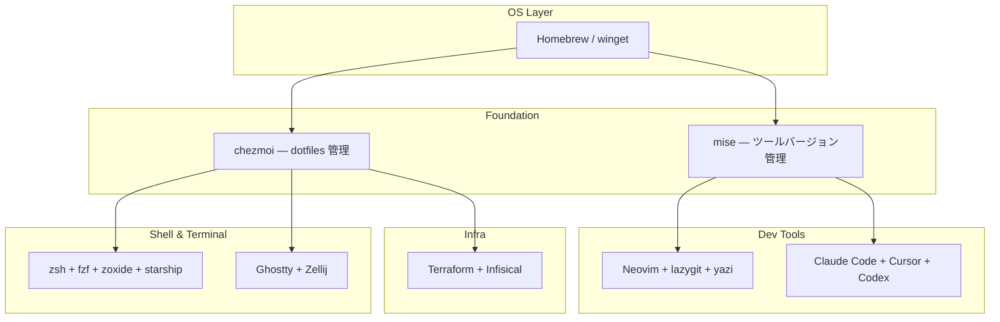

# dotfiles のすすめ

環境構築、もう悩まない

---

## こんな経験ありませんか？

- PC 買い替えたら **環境構築に丸一日** かかった
- 会社 PC と自宅 PC で **設定がバラバラ** になってる
- 「あの便利な alias どこに書いたっけ？」が頻発する
- OS 再インストール後に **何を入れてたか思い出せない**

**→ 全部 dotfiles で解決できます**

---

## dotfiles とは

`.zshrc`, `.gitconfig` などの設定ファイル群を **Git で管理する仕組み**

- 環境を丸ごとバージョン管理
- 新しいマシンに **ワンコマンド** でセットアップ
- macOS / Linux / WSL をひとつのリポジトリで管理

---

## ツール構成（基盤から順に）



---

## chezmoi — dotfiles マネージャ

設定ファイルの配布・テンプレート化・セットアップスクリプトを一元管理

| 機能 | 例 |
|------|-----|
| テンプレート | OS ごとに設定を分岐（macOS / Linux / Windows） |
| スクリプト | `run_once_*` / `run_onchange_*` で自動セットアップ |
| external | 外部リポジトリのファイルも取り込める |

```bash
# 新しいマシンでの初回セットアップ
sh -c "$(curl -fsLS get.chezmoi.io)" -- init --apply oda251
```

---

## mise — ランタイム・CLI バージョン管理

`mise.toml` 1ファイルで宣言的に管理

```toml
[tools]
node = "22"
uv = "latest"
rust = "latest"
fzf = "latest"
ripgrep = "latest"
```

asdf の上位互換 — 高速で、npm パッケージや GitHub リリースも管理できる

---

## シェル環境

| ツール | 役割 |
|--------|------|
| **zsh** | シェル本体 |
| **fzf** | あいまい検索（git, docker, kubectl も補完） |
| **zoxide** | `cd` の代替。履歴ベースでジャンプ |
| **eza** | `ls` の代替。アイコン付き |
| **bat** | `cat` の代替。シンタックスハイライト |
| **starship** | プロンプトのカスタマイズ |

---

## ターミナル & エディタ

| ツール | 役割 |
|--------|------|
| **Ghostty** | GPU 描画のターミナルエミュレータ |
| **Zellij** | ターミナルマルチプレクサ（tmux 代替） |
| **Neovim** | エディタ（Lazy.nvim でプラグイン管理） |
| **lazygit** | Git 操作の TUI |
| **yazi** | ターミナルファイルマネージャ。プレビュー・Git 連携 |

---

## Terraform — インフラも dotfiles で管理

GitHub リポジトリや New Relic の設定を Terraform + Terragrunt でコード化

```
terraform/
├── common/    # Infisical シークレット管理
├── github/    # GitHub リポジトリ・環境設定
├── newrelic/  # New Relic ダッシュボード・監視
└── root.hcl   # Terragrunt 共通設定
```

シークレットは **Infisical** で一元管理 → Terraform 変数に注入

---

## AI エージェント設定の一元管理

Claude Code / Cursor / Codex の設定を **1箇所で管理し、自動配布**

```
ai-agent-configs/
├── skills/        # 共通スキル定義
├── references/    # 技術スタック・ポリシー
├── hooks/         # セッション開始時の処理
└── routes.txt     # どこに何を配布するかのマッピング
```

lefthook（Git フック）でコミット前に自動同期 → **設定の乖離が起きない**

---

## まとめ

| Before | After |
|--------|-------|
| 新マシンセットアップに丸一日 | **ワンコマンド** |
| 設定は手動コピー | **Git で自動管理** |
| ツールバージョンはバラバラ | **mise.toml で宣言** |
| AI ツール設定はツールごと個別 | **1箇所で一元管理** |

**dotfiles は「未来の自分への贈り物」**
