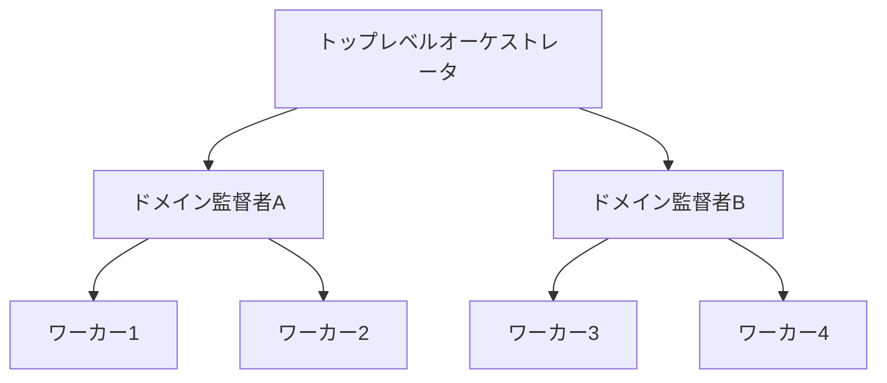

# エージェントオーケストレーション モダンプラクティス (2025-2026)

## フレームワーク比較

| フレームワーク | スタイル | 階層サポート | 宣言的定義 | 特徴 |
|--------------|---------|------------|-----------|------|
| LangGraph | 命令的（グラフ） | サブグラフで対応 | なし | 最も実戦的。状態管理・チェックポイント・LangSmith観測性 |
| CrewAI | 宣言的（YAML）+命令的 | Crew間委譲、Flows | YAML（推奨） | 導入最速。MCP/A2A対応。44.6K stars |
| Google ADK | 命令的（プリミティブ） | 最も強い（サブエージェント=ツール） | 部分的 | 8つの設計パターン内蔵。A2Aネイティブ |
| MS Agent Framework | 命令的 | 複数モード | なし | AutoGen+Semantic Kernel統合。エンタープライズ向け |
| OpenAI Agents SDK | 命令的（最小抽象） | ハンドオフのみ | なし | Swarmの後継。ガードレール内蔵 |
| Anthropic Agent SDK | 命令的 | サブエージェント | なし | Claude Code基盤。セッション管理・スキル・フック |

## Claude Codeを外部から制御する方法

### Agent SDK（公式）

```bash
# 非対話ワーカーとして実行
claude -p "auth.pyのバグを修正して" --allowedTools "Read,Edit,Bash" --output-format json

# セッション再開による多ターンオーケストレーション
session_id=$(claude -p "レビュー開始" --output-format json | jq -r '.session_id')
claude -p "レビュー続行" --resume "$session_id"
```

### LangGraphからの呼び出し

LangGraphのノードはPython関数なので、以下が可能：

- `claude -p` をsubprocessとしてノード内から呼び出す
- Agent SDK Pythonパッケージをネイティブ関数として使う
- セッションresumeで状態を持つツールとして扱う

### Composio

LangChain、LangGraph、OpenAI Agents SDK等とClaude Codeをブリッジするラッパー。

## 階層的エージェントパターン

### プロダクション標準パターン



- **トップレベル**: リクエスト分析、グローバル状態管理、エラー回復
- **ドメイン監督者**: スコープ限定のデータ・ツールアクセス
- **ワーカー**: ステートレス、単一機能

### 50+エージェント規模ではほぼ唯一の選択肢

## 宣言的定義の動向

### 主要な仕様

| 仕様 | 形式 | 特徴 |
|------|------|------|
| Oracle Open Agent Spec | JSON/YAML | フレームワーク非依存。ランタイムアダプタでLangGraph/CrewAI/AutoGenに変換可能 |
| Moca ADL | TBD | "OpenAPI for AI Agents"。ガバナンス重視。Apache 2.0 |
| CrewAI YAML | YAML | 最も成熟した実用的宣言定義 |

### CrewAI YAML例

```yaml
researcher:
  role: "Senior Research Analyst"
  goal: "Find comprehensive data on {topic}"
  backstory: "Expert researcher with 10 years experience..."
  tools:
    - web_search
    - document_reader
```

## プロトコルスタック: MCP + A2A

2024→2025-2026の最大パラダイムシフト。「どのフレームワークか」から「どのプロトコルか」へ。

| プロトコル | 役割 | 提唱 |
|-----------|------|------|
| MCP (Model Context Protocol) | エージェント↔外部ツール・データ接続の標準化 | Anthropic |
| A2A (Agent-to-Agent) | 異ベンダー間エージェント通信の標準化 | Google |

この2つが「エージェントAIのHTTP」になりつつある。

## 2026年のプロダクション勝ちパターン

**戦略層**: 高レベルオーケストレータによる調整（LangGraph等）
**戦術層**: ローカルメッシュによる実行（サブエージェント、エージェントチーム）
**定義**: 宣言的（CrewAI YAML / Oracle Agent Spec）
**接続**: MCP/A2Aプロトコルによる相互運用

## アンチパターン（再掲・補足）

- **単一エージェントで足りるのにマルチ化**: レイテンシ・コスト・調整コスト増大
- **フレームワーク選定の過剰議論**: プロトコル（MCP/A2A）で繋がるのでフレームワークは混在可能
- **FinOpsの欠如**: エージェントワークロードのコスト管理は必須要件に昇格

## 参考資料

- [Anthropic - Building Effective Agents](https://www.anthropic.com/engineering/building-effective-agents)
- [Anthropic - Building Agents with the Claude Agent SDK](https://www.anthropic.com/engineering/building-agents-with-the-claude-agent-sdk)
- [Claude Code - Headless Mode](https://code.claude.com/docs/en/headless)
- [Oracle Open Agent Spec](https://github.com/oracle/agent-spec)
- [Google ADK - Multi-Agent Patterns](https://developers.googleblog.com/developers-guide-to-multi-agent-patterns-in-adk/)
- [LangGraph Architecture Guide 2025](https://latenode.com/blog/ai-frameworks-technical-infrastructure/langgraph-multi-agent-orchestration/)
- [CrewAI Framework 2025 Review](https://latenode.com/blog/ai-frameworks-technical-infrastructure/crewai-framework/)
- [Microsoft Agent Framework](https://learn.microsoft.com/en-us/agent-framework/overview/)
- [Moca Agent Definition Language](https://www.infoq.com/news/2026/02/agent-definition-language/)
- [MCP vs A2A Complete Guide 2026](https://dev.to/pockit_tools/mcp-vs-a2a-the-complete-guide-to-ai-agent-protocols-in-2026-30li)
- [Databricks - Multi-Agent Supervisor Architecture](https://www.databricks.com/blog/multi-agent-supervisor-architecture-orchestrating-enterprise-ai-scale)
