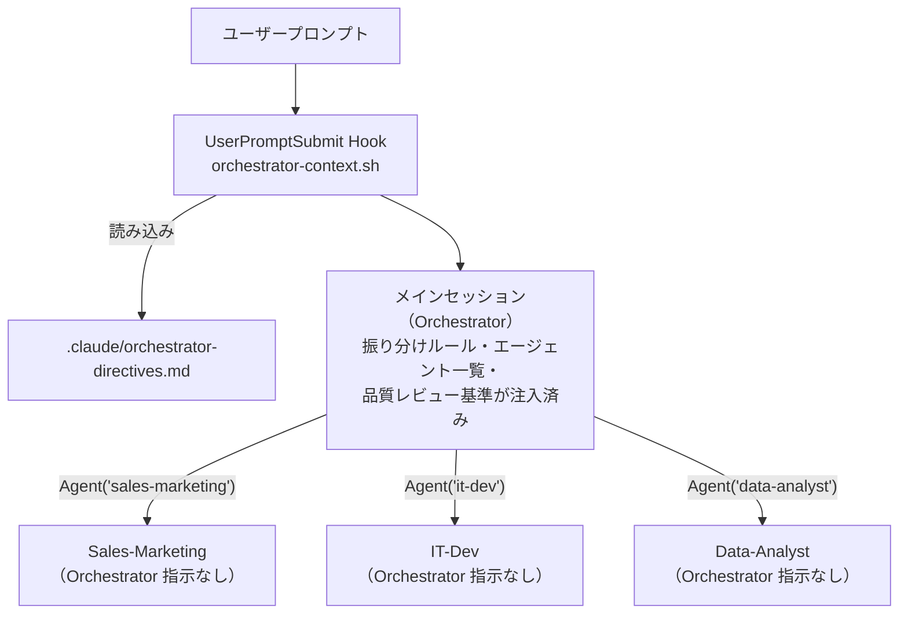
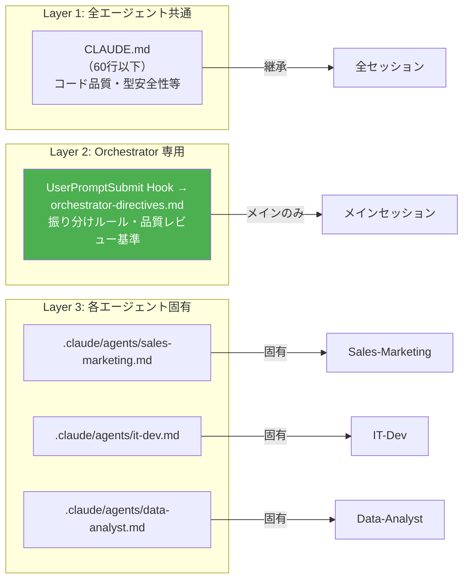
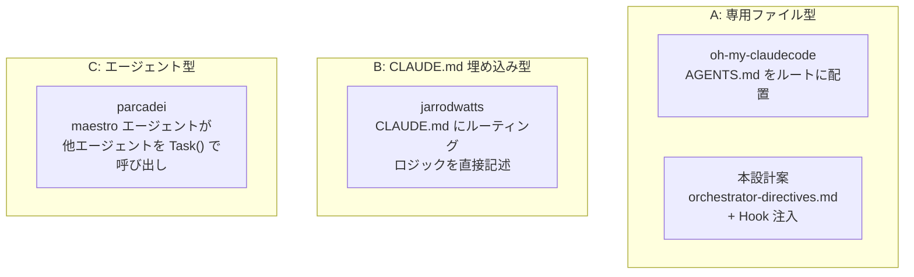
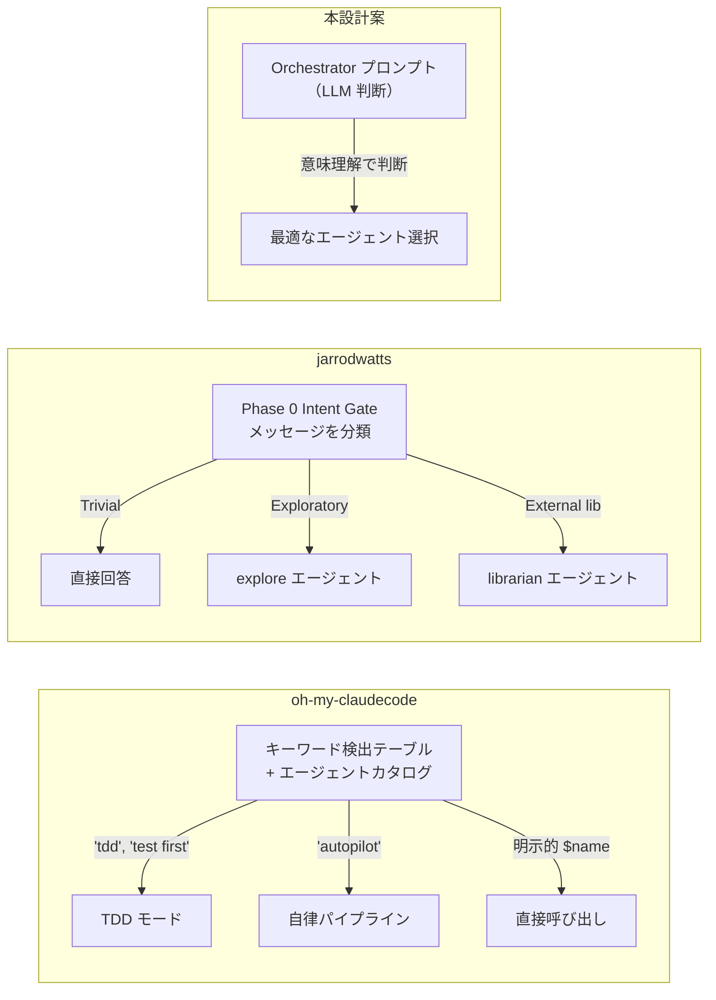
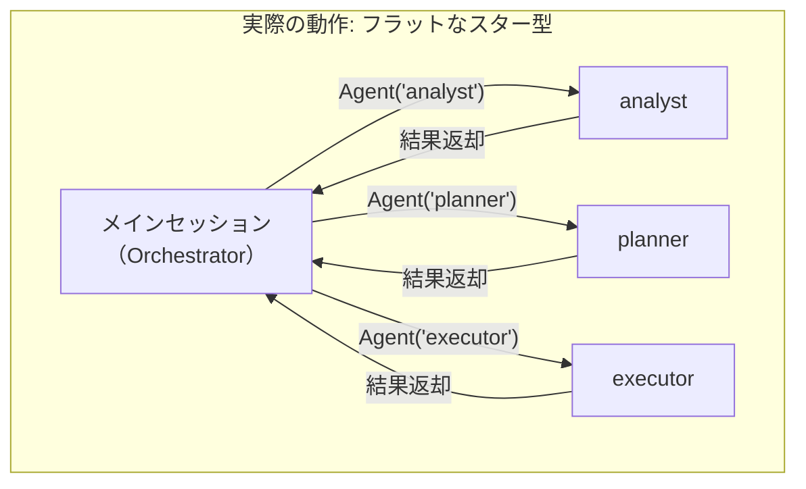
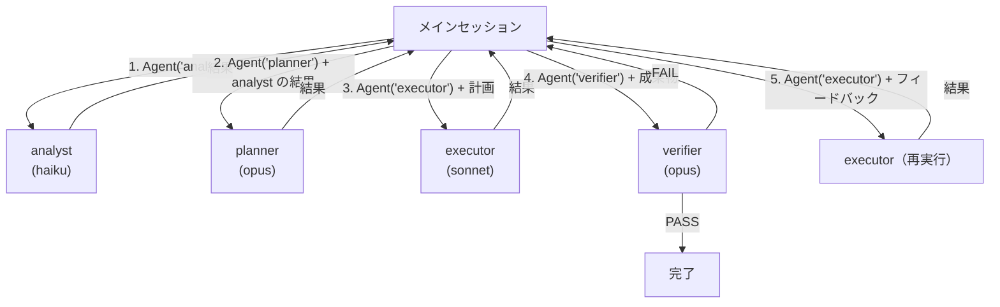
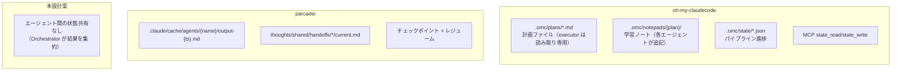

# 設計: Orchestrator コンテキスト分離アーキテクチャ

作成日: 2026-03-19
ステータス: 設計段階

## 課題

Claude Code のマルチエージェント構成（Orchestrator パターン）において:

1. CLAUDE.md はサブエージェントにも継承されるため、Orchestrator 専用の指示を置くとコンテキスト汚染が起きる
2. 「メインセッションのみ」にコンテキストを限定するネイティブ機構は存在しない（Feature Request #4908, #8395, #24773 はいずれも却下済み）
3. Memory（MEMORY.md）はメインセッション専用だが、蓄積型であり構造的な指示の置き場としては不安定

## 解決策: UserPromptSubmit Hook による Orchestrator 専用コンテキスト注入

`UserPromptSubmit` Hook を使い、メインセッションにのみ Orchestrator の指示を注入する。

### なぜこれが機能するか

- `UserPromptSubmit` はユーザーがプロンプトを送信するたびに発火する（LLM 判断に非依存、~95%+ の信頼性）
- サブエージェントはユーザー入力を受けないため、**このイベントはメインセッションでしか発火しない**
- `additionalContext` で注入された内容はメインセッションのコンテキストにのみ載る

### アーキテクチャ



### コンテキストの3層分離



## ファイル構成

```
.claude/
├── CLAUDE.md                          # Layer 1: 全エージェント共通（60行以下）
├── orchestrator-directives.md         # Layer 2: Orchestrator 専用指示
├── hooks/
│   └── orchestrator-context.sh        # UserPromptSubmit Hook
├── agents/
│   ├── sales-marketing.md             # Layer 3: 各エージェント定義
│   ├── strategy-biz-dev.md
│   ├── it-dev.md
│   ├── content-docs.md
│   ├── ops-workflow.md
│   ├── external-intelligence.md
│   ├── data-analyst.md
│   └── video-generator.md
├── rules/                             # パス限定ルール（補助）
│   ├── api-guidelines.md
│   └── auth-security.md
└── settings.json                      # Hook 登録
```

## 実装詳細

### settings.json

```json
{
  "hooks": {
    "UserPromptSubmit": [
      {
        "matcher": "",
        "hooks": [
          {
            "type": "command",
            "command": ".claude/hooks/orchestrator-context.sh"
          }
        ]
      }
    ]
  }
}
```

### orchestrator-context.sh

Hook の責務は **orchestrator-directives.md を読み込んで注入するだけ**。振り分けロジック（どのエージェントに委譲するか）は directives 内の Orchestrator プロンプトに含め、LLM の判断に委ねる。

```bash
#!/bin/bash
# Orchestrator 専用コンテキストをメインセッションに注入する
# 責務: directives ファイルの読み込みと注入のみ。振り分け判断は行わない。

INPUT=$(cat)
PROJECT_DIR=$(echo "$INPUT" | jq -r '.cwd // empty')

DIRECTIVES_PATH="$PROJECT_DIR/.claude/orchestrator-directives.md"
if [ -f "$DIRECTIVES_PATH" ]; then
  ESCAPED=$(jq -Rs . < "$DIRECTIVES_PATH")
  echo "{\"hookSpecificOutput\":{\"hookEventName\":\"UserPromptSubmit\",\"additionalContext\":$ESCAPED}}"
fi

exit 0
```

### orchestrator-directives.md（例）

振り分けロジック・エージェント一覧・品質基準をすべてこのファイルに集約する。Hook はこのファイルを丸ごと注入するだけなので、**Orchestrator の振る舞いはこのファイルだけで制御できる**。

```markdown
# Orchestrator 指示

## 役割
あなたは専門エージェントを統括する司令塔（Orchestrator）である。
ユーザーの要求を分析し、適切な専門エージェントに委譲せよ。

## 振り分け原則
1. 要求の専門領域を判断し、下記エージェント一覧から最適なエージェントを選択する
2. 複数領域にまたがる場合は、複数エージェントを並行で起動する
3. 単純な質問や雑談にはエージェントを使わず直接回答する
4. 判断に迷う場合はユーザーに確認する

## エージェント一覧

| # | エージェント名 | 専門領域 | モデル | 呼び出し例 |
|---|---|---|---|---|
| 01 | sales-marketing | 営業・広告・マーケティング・LP・キャンペーン | sonnet | Agent('sales-marketing', model='sonnet') |
| 02 | strategy-biz-dev | 経営戦略・M&A・法務・事業計画 | opus | Agent('strategy-biz-dev', model='opus') |
| 03 | it-dev | 開発・インフラ・QA・CI/CD・バグ修正 | sonnet | Agent('it-dev', model='sonnet') |
| 04 | content-docs | 文書作成・プレゼン・資料・スライド | sonnet | Agent('content-docs', model='sonnet') |
| 05 | ops-workflow | 業務フロー・経理・請求・ワークフロー自動化 | sonnet | Agent('ops-workflow', model='sonnet') |
| 06 | external-intelligence | 海外市場調査・翻訳・顧客分析 | sonnet | Agent('external-intelligence', model='sonnet') |
| 07 | data-analyst | データ分析・因果推論・統計・BI・ダッシュボード | sonnet | Agent('data-analyst', model='sonnet') |
| 08 | video-generator | 動画制作・アニメーション・映像 | opus | Agent('video-generator', model='opus') |

## 品質レビュー
- サブエージェントの成果物は必ずレビューしてからユーザーに返す
- 不十分な場合は具体的なフィードバックを添えて再委譲する
- 複数エージェントの成果物を統合する場合は、一貫性を確認する
```

## 設計判断: なぜ Hook 側でキーワードマッチしないか

当初はキーワードマッチで ROUTING HINT を動的に追加する案を検討したが、以下の理由で却下した:

1. **振り分けは LLM の得意領域**: キーワードの正規表現マッチより、Orchestrator（Opus）の意味理解の方が正確
2. **キーワード衝突のリスク**: "開発" が意図しない文脈でマッチする等、フォールスポジティブが避けられない
3. **メンテナンスの二重化**: エージェント追加時に directives.md と Hook スクリプト両方を更新する必要がある
4. **責務の明確化**: Hook = 注入インフラ、directives.md = Orchestrator の頭脳。分離することで変更が局所化する

## トレードオフ

### メリット
- CLAUDE.md をクリーンに保てる（全エージェント共通ルールのみ）
- Orchestrator の指示がサブエージェントに漏れない
- 振り分けロジックが directives.md に集約され、Hook スクリプトの変更が不要
- ネイティブ機構の不在を補う実用的な回避策

### デメリット・リスク
- **毎プロンプトで Hook が実行される**（ファイル読み込み + jq のみなので軽量）
- **orchestrator-directives.md の肥大化**に注意が必要（注入量 = コンテキスト消費量）
- **Orchestrator の振り分け精度が LLM の判断に依存**する（ただしこれは Opus の強みでもある）

### 緩和策
- orchestrator-directives.md は簡潔に保つ（目安: 50行以下）
- エージェント一覧に「専門領域」を具体的に書き、振り分け精度を高める
- 定期的に振り分け精度を確認し、directives.md のプロンプトを改善する

## 他リポジトリのオーケストレーション設計との比較

### オーケストレーションの配置場所

各リポジトリで Orchestrator のロジックを**どこに置くか**が異なる。3つのアプローチに大別される。



| アプローチ | 代表リポジトリ | コンテキスト汚染 | 透過性 | メンテナンス性 |
|-----------|--------------|----------------|--------|--------------|
| **A: 専用ファイル + Hook** | 本設計, oh-my-claudecode | なし（Hook 注入） | **常時透過**（通常の `claude` 起動で自動的に Orchestrator 化） | directives.md のみ編集 |
| **B: CLAUDE.md 埋め込み** | jarrodwatts | あり（サブエージェントに継承） | 常時透過 | CLAUDE.md 肥大化リスク |
| **C: Orchestrator エージェント** | parcadei | なし | **毎回明示的に `claude --agent maestro` で起動が必要** | エージェント定義のみ編集 |

本設計（A）が parcadei（C）より優れる点は**透過性**にある。ユーザーは通常通り `claude` を起動するだけで、Hook が自動的に Orchestrator プロンプトを注入する。特別な起動方法を覚える必要がない。

### ルーティングメカニズムの比較



| メカニズム | リポジトリ | 信頼性 | 拡張性 | 特徴 |
|-----------|-----------|--------|--------|------|
| **キーワード検出 + カタログ** | oh-my-claudecode | 高（明示的マッチ） | キーワード追加が必要 | 最長マッチ優先、`$name` で明示呼び出し可 |
| **Intent 分類ゲート** | jarrodwatts | 中（LLM 依存） | 分類ルール追加 | 6種分類（Trivial/Explicit/Exploratory 等） |
| **LLM 意味判断** | 本設計案 | 中（LLM 依存） | エージェント追加のみ | 最もシンプル。Opus の判断力に依存 |
| **明示的 Task dispatch** | parcadei | 高（構造的） | エージェント追加のみ | `claude --agent maestro` でメインセッション化し Task() で直接指名 |

### エージェント定義のフロントマター比較

実際のエージェント定義ファイルから抽出した構造:

```yaml
# oh-my-claudecode: architect エージェント
---
name: architect
model: claude-opus-4-6
disallowedTools: Write, Edit   # 読み取り専用を構造的に強制
---

# parcadei: kraken エージェント（TDD 実装担当）
---
name: kraken
model: opus
tools: [Read, Bash, Grep, Glob, Task, Edit, Write]
---

# jarrodwatts: media-interpreter エージェント
---
name: media-interpreter
model: haiku
color: yellow
tools: [Read, Bash, Glob, Grep]   # 書き込み不可
---
```

注目すべきプラクティス:

- **`disallowedTools` による読み取り専用エージェント**（oh-my-claudecode）: architect に Write/Edit を禁止し、設計と実装の関心分離をツールレベルで強制
- **モデルの3段階使い分け**（oh-my-claudecode）: haiku（探索・安価） / sonnet（実装） / opus（判断・設計）
- **`color` フィールド**（jarrodwatts）: ターミナル上でエージェントを視覚的に区別

### マルチエージェント協調パターン

#### アーキテクチャ制約: サブエージェントのネスト不可

Claude Code のサブエージェントは **他のサブエージェントを呼び出せない**。Agent ツールはメインセッションでのみ使用可能で、ネストの深さは常に1段。



したがって、以下のパターンはすべて**メインセッションがハブとなって逐次/並列に Agent() を呼び出す**ことで実現される。エージェント間の直接連鎖（A→B→C）は不可能。

#### パイプライン型（oh-my-claudecode）

メインセッションが逐次的にエージェントを呼び出し、前のエージェントの結果を次のプロンプトに含める。



#### 協調パターンの概念整理（parcadei を参考に）

parcadei/Continuous-Claude-v3 はディスパッチパターンに名前をつけているが、いずれも**メインセッション（または `claude --agent maestro` で起動した maestro）がハブとなるフラット構造**で実現される。エージェント間の直接連鎖ではない。

| パターン | メインセッションの動作 | 用途 |
|---------|---------------------|------|
| **Sequential** | Agent(A) → 結果回収 → Agent(B) → 結果回収 → Agent(C) | 工程が明確なワークフロー |
| **Parallel** | Agent(A), Agent(B), Agent(C) を同時呼び出し → 結果統合 | 調査・リサーチ |
| **Iterative** | Agent(生成) → Agent(批評) → フィードバックで Agent(生成) → ... ループ | 品質要求が高い成果物 |
| **Fan-out/Vote** | 同一タスクを複数エージェントに投げ → 結果を比較・投票 | リスクの高い判断 |

#### 並行実行の制御

oh-my-claudecode は最大6つの子エージェントを同時実行可能。メインセッションから複数の Agent() を同一ターンで呼び出すことで並列化する:
```
Agent(prompt: "Review the auth module", subagent_type: "architect")
Agent(prompt: "Add input validation", subagent_type: "executor")
Agent(prompt: "Write tests", subagent_type: "test-engineer")
```

#### 成果物のレビュー

| リポジトリ | レビュー方式 | 特徴 |
|-----------|------------|------|
| oh-my-claudecode | 専用 verifier エージェント | 新鮮なテスト出力必須、"should/probably" 表現を拒否 |
| jarrodwatts | メインセッションが検証 | 7セクション委譲の MUST DO/MUST NOT DO に照合 |
| parcadei | arbiter エージェント | 最終品質ゲート |
| 本設計案 | Orchestrator が直接レビュー | directives.md の品質レビュー基準に従う |

### エージェント間の状態共有



### 本設計への示唆

調査から得られた、本設計に取り入れる価値のあるプラクティス:

1. **`disallowedTools` の活用**: 調査系エージェントに Write/Edit を禁止し、意図しないコード変更を構造的に防止する
2. **モデルの段階使い分け**: 判断が必要なエージェント（strategy-biz-dev）は opus、実行系は sonnet、探索系は haiku と明確にする
3. **品質レビューの形式化**: 現状の「レビューしてから返す」だけでなく、レビュー基準の具体化（oh-my-claudecode の verifier のように「新鮮なテスト出力必須」等）が有効
4. **Intent Gate の検討**: 全プロンプトをエージェント振り分けにかけるのではなく、まず「直接回答可能か」を判断するゲートを設ける（jarrodwatts の Phase 0）
5. **状態共有の段階的導入**: 初期は Orchestrator 集約型（本設計）で十分。複雑化したら `.omc/` のようなファイルベース状態共有を検討

## 関連ドキュメント

- [コンテキスト管理プラクティス調査（構造・分割編）](../investigation/2026-03-19-claude-code-context-management-practices.md)
- [コンテキスト管理プラクティス調査（検索・取得編）](../investigation/2026-03-19-claude-code-context-retrieval-practices.md)
