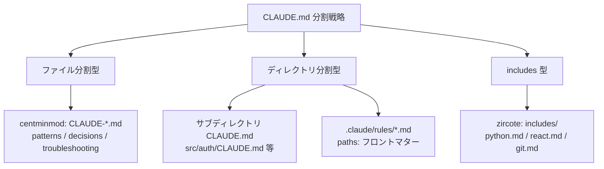
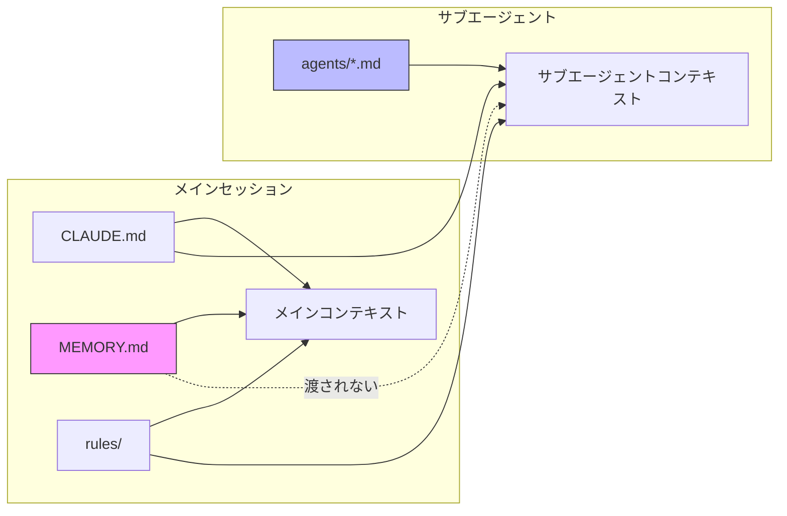
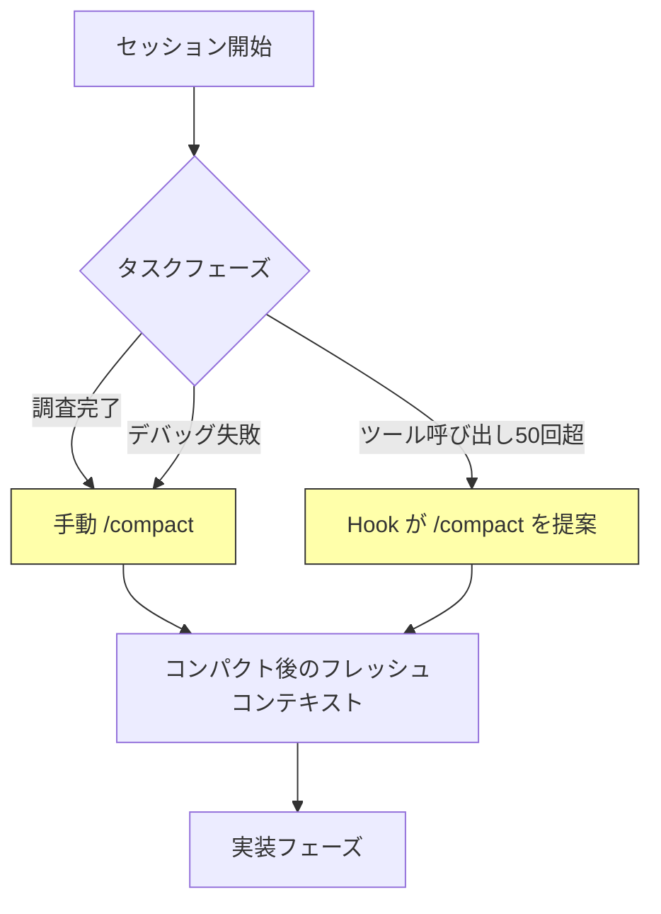
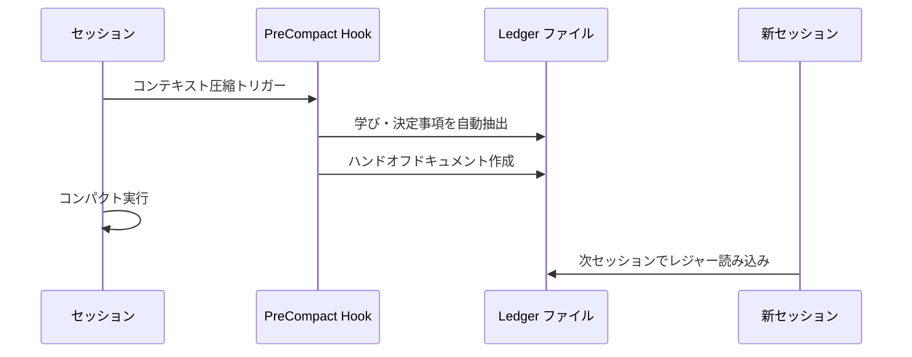
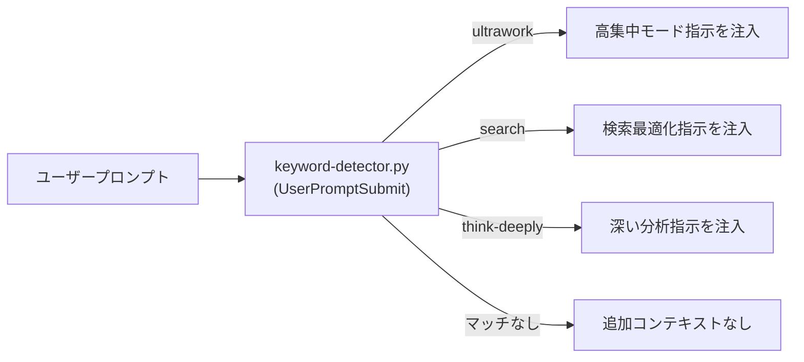
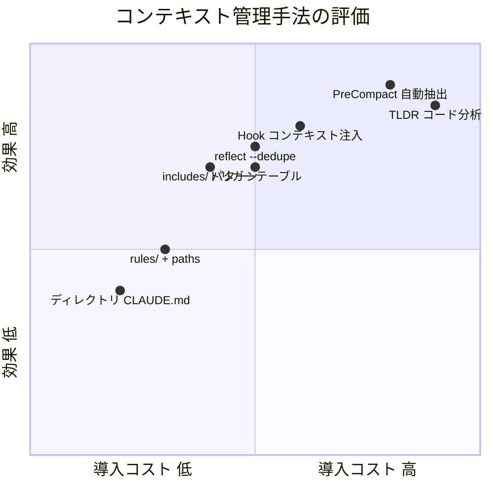

# Claude Code コンテキスト管理プラクティス調査（構造・分割編）

調査日: 2026-03-19

> 本ドキュメントはコンテキストの「分割・サイズ管理・汚染防止」を扱う。
> 「適切な情報を取りに行かせる」検索・取得の課題は [検索・取得編](./2026-03-19-claude-code-context-retrieval-practices.md) を参照。

## 背景・目的

Claude Code でマルチエージェント構成（Orchestrator パターン）を運用する際、コンテキスト汚染が課題となる。人気リポジトリにおけるコンテキスト管理の手法・傾向を調査し、自プロジェクトへの適用指針を得る。

## 調査対象リポジトリ

| Stars | リポジトリ | 主な特徴 |
|------:|-----------|---------|
| 50K+ | affaan-m/everything-claude-code | 25エージェント・108スキルの大規模プラグイン |
| 2,081 | centminmod/my-claude-code-setup | Memory Bank パターン |
| 980 | jarrodwatts/claude-code-config | Hook ベースのコンテキスト注入 |
| 831 | BayramAnnakov/claude-reflect | 自己学習 + 自動重複排除 |
| 170 | 0xquinto/bcherny-claude | Boris Cherny 流の自己改善ループ |
| 15 | zircote/.claude | includes/ パターンによるオンデマンド合成 |
| — | parcadei/Continuous-Claude-v3 | Hook-only アーキテクチャ、MCP フリー |

## 調査結果

### 1. コンテキストサイズ管理

#### 1.1 CLAUDE.md を軽量ハブにする原則

全リポジトリに共通する最も重要なプラクティス。CLAUDE.md に全ルールをインライン記述するのではなく、**ポインタ（参照）のみ**を置く。

HumanLayer のブログでは「attention budget」という概念を提唱。Claude Code のシステムプロンプトだけで約50スロットを消費し、CLAUDE.md の各行が残りを奪い合う。**1行追加するたびに他の指示の遵守率が下がる**。推奨上限は約60行。

```markdown
# CLAUDE.md（軽量ハブの例）
## Architecture
複雑な構成 → docs/architecture.md を参照
テストパターン → docs/testing-guide.md を参照
```

#### 1.2 分割戦略の比較



| 戦略 | 代表リポジトリ | ロードタイミング | 長所 | 短所 |
|------|--------------|----------------|------|------|
| **ファイル分割** | centminmod | 全ファイル常時ロードの可能性 | シンプル | 分割しても全部読まれるリスク |
| **ディレクトリ CLAUDE.md** | 公式推奨 | 該当ディレクトリで作業時のみ | ネイティブ対応 | モノレポ向き |
| **rules/ + paths:** | jarrodwatts | 該当パスのファイル操作時のみ | 細粒度制御 | 設定が煩雑 |
| **includes/** | zircote | Claude の判断で都度読み込み | 最も柔軟 | Claude の判断に依存 |

#### 1.3 トリガーテーブルによる遅延ロード（everything-claude-code）

スキルをセッション開始時に全ロードせず、キーワードマッチで必要時のみロードする手法。ベースラインのコンテキスト消費を50%以上削減と主張。

```
"test", "tdd", "coverage" → tdd-workflow スキル
"security", "vulnerability" → security-reviewer スキル
```

### 2. コンテキスト汚染防止

#### 2.1 現状のコンテキスト伝播モデル



**重要な制約**: 「メインセッションのみ」にコンテキストを限定するネイティブ機構は存在しない。Feature Request（#4908, #8395, #24773）はいずれも Not Planned でクローズ済み。

#### 2.2 サブエージェントへの委譲プロトコル（jarrodwatts）

7セクションの構造化委譲により、サブエージェントに渡るコンテキストを明示的に制御する。

```
TASK: 具体的なタスク記述
EXPECTED OUTCOME: 期待する成果物
REQUIRED SKILLS: 必要なスキル
REQUIRED TOOLS: 明示的なツールホワイトリスト
MUST DO: 必須事項
MUST NOT DO: 禁止事項（スコープクリープ防止）
CONTEXT: 必要最小限のコンテキスト
```

#### 2.3 MCP ツールスプロール問題

Continuous-Claude-v3 が明示的に警告する問題。MCP サーバーを追加するたびに、そのツール説明文がコンテキストを消費する。

推奨（everything-claude-code の performance.md）:
- プロジェクトあたり MCP 10個以下
- アクティブツール 80個以下
- コンテキストウィンドウの最後20%は大規模リファクタリングに使わない

### 3. セッション間の継続性

#### 3.1 戦略的コンパクション（everything-claude-code）



コンパクションのタイミングが重要:
- **適切**: 調査→実装の切り替え時、デバッグ失敗後、アプローチ変更後
- **不適切**: 実装途中（コードの文脈が失われる）

#### 3.2 "Compound, don't compact" 哲学（Continuous-Claude-v3）

コンパクションの前に学びを抽出し、フレッシュに再開する哲学。



核心: コンテキストを保持しようとするのではなく、**構造化された知識として外部化**してから手放す。

#### 3.3 TLDR コード分析（Continuous-Claude-v3）

ファイル読み込み時に生のコードではなく構造的要約を返す Hook。23,000トークン → 約1,200トークン（95%削減）。

5層の分析:
1. AST（構文木）
2. Call Graph（呼び出しグラフ）
3. Control Flow（制御フロー）
4. Data Flow（データフロー）
5. Program Slicing（プログラムスライシング）

### 4. 自己改善とフィードバックループ

#### 4.1 手法の比較

| 手法 | リポジトリ | 肥大化対策 | 精度 |
|------|-----------|-----------|------|
| **手動ルール追加** | bcherny | なし（リスク大） | 高（人間判断） |
| **自動キャプチャ + 人間ゲート** | claude-reflect | `/reflect --dedupe` | 中〜高 |
| **プロジェクトスコープ学習** | everything-claude-code | プロジェクト単位分離 | 中 |

claude-reflect の重複排除が最も体系的:
- セッション中の修正を自動キャプチャ（キューイング）
- `/reflect` で人間が確認してから永続化
- `--dedupe` で意味的に類似するエントリを統合
- 信頼度スコア（0.60〜0.95）で低確信の学びはステージング止まり

#### 4.2 フィルタリング基準

claude-reflect が自動除外するもの:
- 質問（一時的な疑問）
- ワンショットタスク指示
- コンテキスト依存のリクエスト
- 曖昧なフィードバック

### 5. Hook ベースのコンテキスト制御

#### 5.1 Hook によるコンテキスト注入（jarrodwatts）



`additionalContext` JSON フィールドを通じて、必要な時だけ指示を注入。静的に全ルールをロードするより効率的。

#### 5.2 Hook-only アーキテクチャ（Continuous-Claude-v3）

MCP サーバーを一切使わず、Claude Code のネイティブ Hook ライフサイクルのみで構築:
- `SessionStart`: レジャーロード
- `PreToolUse`: TLDR 変換、スマートルーティング
- `PostToolUse`: コメントチェック、コンパイラフィードバック
- `PreCompact`: 自動ハンドオフ作成
- `SubagentStop`: サブエージェント結果処理
- `SessionEnd`: メモリ抽出デーモン起動

## プラクティス横断比較



## 推奨アプローチ（段階的導入）

### Phase 1: 低コスト・即効性

1. **CLAUDE.md を60行以下に圧縮** — 詳細は外部ファイルへポインタ
2. **`.claude/rules/` にパス限定ルール配置** — 言語・ドメイン別に分離
3. **サブディレクトリ CLAUDE.md** — モジュール固有ルールの局所化

### Phase 2: 中程度の投資

4. **includes/ パターン導入** — 言語・ワークフロー別のコンテキスト断片
5. **構造化委譲プロトコル** — サブエージェントへの7セクション委譲
6. **`/reflect` 的な自己改善ループ** — 重複排除付き

### Phase 3: 高度な最適化

7. **Hook ベースのコンテキスト注入** — キーワードマッチで動的注入
8. **PreCompact Hook** — コンパクション前の自動知識抽出
9. **TLDR コード分析** — ファイル読み込みの構造的要約化

## 参考リソース

- [HumanLayer: Writing a Good CLAUDE.md](https://www.humanlayer.dev/blog/writing-a-good-claude-md)
- [Shrivu Shankar: How I Use Every Claude Code Feature](https://blog.sshh.io/p/how-i-use-every-claude-code-feature)
- [GitHub Issue #4908: Scoped Context Passing](https://github.com/anthropics/claude-code/issues/4908)
- [josix/awesome-claude-md](https://github.com/josix/awesome-claude-md)
- [affaan-m/everything-claude-code](https://github.com/affaan-m/everything-claude-code)
- [centminmod/my-claude-code-setup](https://github.com/centminmod/my-claude-code-setup)
- [jarrodwatts/claude-code-config](https://github.com/jarrodwatts/claude-code-config)
- [BayramAnnakov/claude-reflect](https://github.com/BayramAnnakov/claude-reflect)
- [0xquinto/bcherny-claude](https://github.com/0xquinto/bcherny-claude)
- [zircote/.claude](https://github.com/zircote/.claude)
- [parcadei/Continuous-Claude-v3](https://github.com/parcadei/Continuous-Claude-v3)
