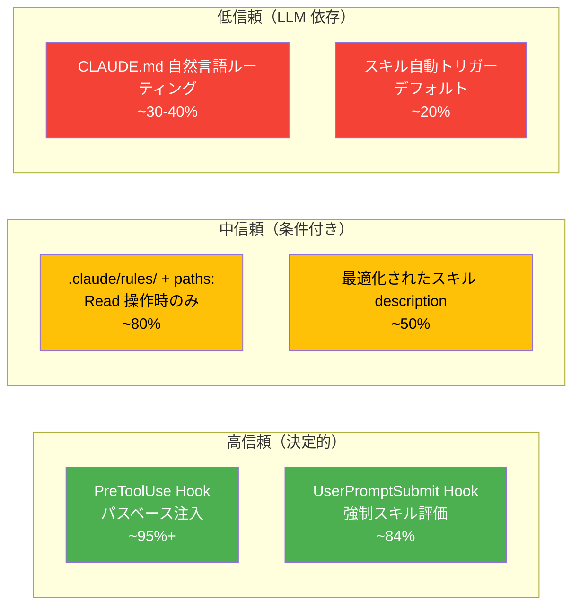
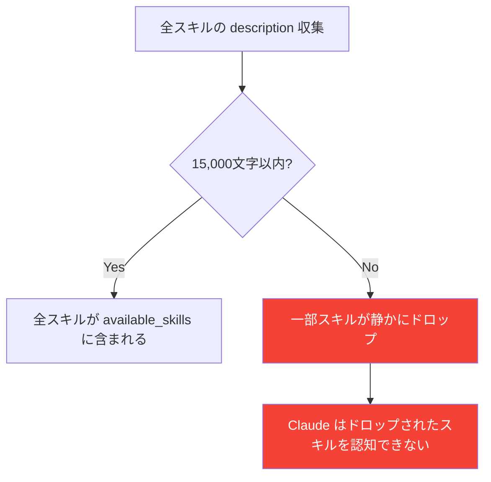
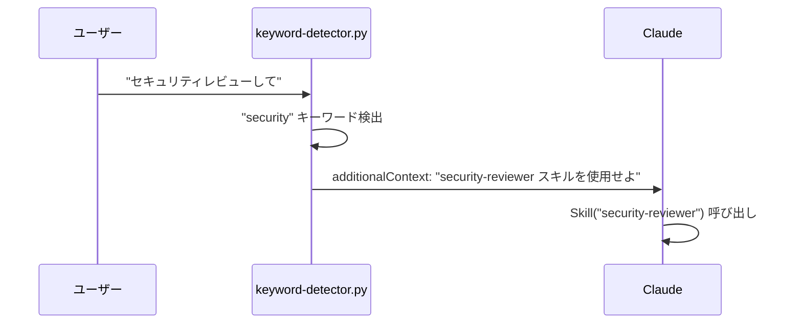
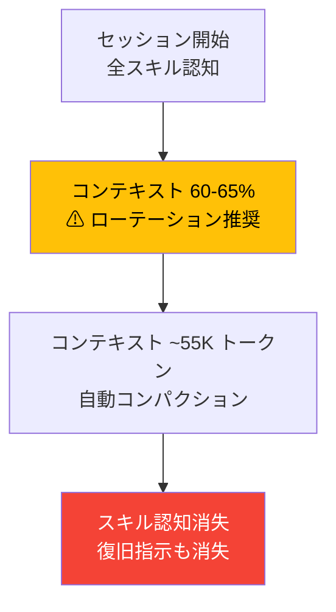
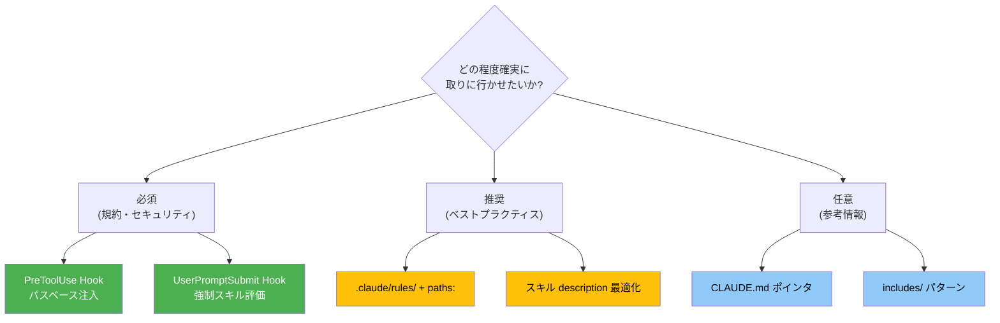

# Claude Code コンテキスト管理プラクティス調査（検索・取得編）

調査日: 2026-03-19

> 本ドキュメントは「分割したコンテキストをいかに適切に取りに行かせるか」を扱う。
> コンテキストの「分割・サイズ管理・汚染防止」は [構造・分割編](./2026-03-19-claude-code-context-management-practices.md) を参照。

## 背景・課題

コンテキスト汚染を避けるためにドキュメント・スキル・ルールを分割するのは正しいアプローチだが、**分割しても取りに行かなければ意味がない**。Claude が適切なタイミングで適切な情報を参照する「検索・取得」の信頼性が、コンテキスト管理の実効性を左右する。

## 取得メカニズムの信頼性ランキング

調査の結果、メカニズムごとに信頼性に大きな差があることが判明した。



| メカニズム | 信頼性 | トレードオフ |
|-----------|--------|------------|
| **PreToolUse Hook**（パスベース注入） | ~95%+ | メンテ負荷あり。毎ツール呼び出しでトークン消費 |
| **UserPromptSubmit 強制評価 Hook** | ~84% | 毎プロンプトでオーバーヘッド |
| **`.claude/rules/` + paths:** | ~80%（Read のみ） | Write/Create 時は発火しない。ユーザーレベルでは動作しない |
| **最適化されたスキル description** | ~50% | 純粋な LLM 推論に依存。不安定 |
| **CLAUDE.md 自然言語ルーティング** | ~30-40% | コンパクション後に消失。無視されやすい |
| **スキル自動トリガー（デフォルト）** | ~20% | ベースライン。実質的に信頼できない |

## 1. スキルのトリガーメカニズム

### 1.1 description フィールドの仕組み

スキルの YAML フロントマターの `description` は、`<available_skills>` XML セクションに集約され、Skill ツールの説明フィールドに埋め込まれる。**システムプロンプトではなくツール説明に含まれる**点が重要。

文字数バジェット: **15,000文字**（`SLASH_COMMAND_TOOL_CHAR_BUDGET` 環境変数で変更可能）。バジェット超過時はスキルが Claude の視野から**静かにドロップ**される。



### 1.2 呼び出し制御の3パターン

| フロントマター | ユーザー呼び出し | Claude 自動呼び出し | コンテキスト消費 |
|---|---|---|---|
| （デフォルト） | 可 | 可 | description 常時ロード |
| `disable-model-invocation: true` | 可 | 不可 | **description もロードされない** |
| `user-invocable: false` | 不可 | 可 | description 常時ロード |

重要: `disable-model-invocation: true` は「自動呼び出しを無効化」するだけでなく、**Claude の認知自体から消える**。副作用の大きいワークフロー（`/deploy` 等）に適切。

### 1.3 効果的な description の書き方

公式ベストプラクティスとコミュニティのテストデータに基づく:

**必須ルール:**
1. **三人称で書く**（"Processes Excel files" であって "I can help you process" ではない）
2. **What + When の2部構成**（"PDFからテキスト抽出。PDF、フォーム、ドキュメント抽出に関する作業時に使用。"）
3. **実際のユーザー語彙からトリガーキーワードを含める**
4. **参照は1階層まで** — ネストされた参照は部分的にしか読まれない

**悪い例:**
```yaml
description: "ドキュメント関連の作業を支援"
```

**良い例:**
```yaml
description: "API仕様書の生成・更新。OpenAPI/Swagger定義、エンドポイント設計、リクエスト/レスポンススキーマに関する作業時に使用"
```

### 1.4 スキルトリガーの既知の障害

| Issue | 問題 | 状態 |
|-------|------|------|
| [#20986](https://github.com/anthropics/claude-code/issues/20986) | description が完全一致でもスキルを無視し、手動で処理 | Open |
| [#13919](https://github.com/anthropics/claude-code/issues/13919) | コンパクション後（~55Kトークン）にスキル認知が消失。復旧指示も消失 | Open |
| [#14016](https://github.com/anthropics/claude-code/issues/14016) | Agent ツールで生成されたサブエージェントでスキルが自動起動しない | Open |
| [#14851](https://github.com/anthropics/claude-code/issues/14851) | スキルが呼び出されずにコンテキストにロードされ、トークンを浪費 | Open |

根本原因（Scott Spence の分析）: "Claude はゴール指向が強すぎて、利用可能なスキルを確認する前に自分のアプローチで突っ走る"

## 2. CLAUDE.md ルーティングパターン

### 2.1 自然言語ルーティングの限界

CLAUDE.md には `@import` や `@route` のような正式な構文は存在しない。すべて自然言語の指示であり、Claude が従うか否かは LLM の判断に依存する。

**信頼性が高いパターン:**
- 命令的・無条件: "コード編集を提案する前に、必ず関連ファイルを読んで理解すること"
- 具体的ファイル参照: "[reference.md](reference.md) にAPI詳細あり"

**信頼性が低いパターン:**
- 条件付きルーティング: "X の作業時は Y を参照" → 一貫性のないフォロースルー
- コンパクション後の復旧プロトコル → CLAUDE.md 自体が要約されて消失
- 「〜してもよい」的な柔らかい指示 → 無視されやすい

### 2.2 centminmod の Memory Bank パターン

構造化された外部ファイル群を CLAUDE.md から参照:

```
CLAUDE-activeContext.md      → 現在のセッション状態
CLAUDE-patterns.md           → コードパターン・規約
CLAUDE-decisions.md          → アーキテクチャ決定記録
CLAUDE-troubleshooting.md    → 既知の問題
```

核心の指示: "常に active context ファイルを最初に参照し、現在の作業内容を理解すること"

## 3. Hook ベースの取得（最も信頼性が高い）

### 3.1 キーワードマッチによるコンテキスト注入（jarrodwatts）

`UserPromptSubmit` Hook がユーザープロンプトをパターンマッチし、`additionalContext` で指示を注入。



**制限事項**: テスト結果では20セッション中50%の起動率。キーワード衝突（"research" が無関係な文脈でマッチ）が問題。

### 3.2 強制スキル評価 Hook（最も効果的なパターン）

umputun のアプローチ。**毎プロンプトで**スキル確認を強制する:

```bash
#!/bin/bash
cat <<'EOF'
INSTRUCTION: MANDATORY SKILL ACTIVATION
Check <available_skills> for relevance before proceeding.
IF any skills are relevant:
  1. State which skills and why
  2. Activate ALL relevant skills with Skill() tool
  3. Then proceed with implementation
CRITICAL: Activate ALL relevant skills via Skill() tool before implementation.
EOF
```

核心の洞察: **"スキルに言及するだけでは無意味 — 実際に Skill() ツールを呼ばせることが重要"**

### 3.3 PreToolUse パスベースコンテキスト注入（最高信頼性）

Sasha Podles のアプローチ。ファイル操作時にパスを見てルールを注入:

```python
PACKAGE_RULES = {
    "/packages/api/": "packages/api/RULES.md",
    "/packages/ui/": "packages/ui/RULES.md",
}
for pkg_path, rules_path in PACKAGE_RULES.items():
    if pkg_path in file_path:
        rules = Path(rules_path).read_text()
        # additionalContext で注入
```

Vercel の調査を引用: "スキルベースの取得は評価ケースの56%でスキップされた" — Hook が唯一の保証された注入メカニズム。

## 4. `.claude/rules/` パストリガーの実態

### 4.1 基本動作

```yaml
---
paths:
  - src/api/**/*.ts
  - src/auth/**/*
---
```

`paths:` フロントマター付きルールは、マッチするファイルにアクセスした時のみ高優先度でロード。`paths:` なしのルールは常時ロード。

### 4.2 既知の制限

| Issue | 問題 | 影響 |
|-------|------|------|
| [#23478](https://github.com/anthropics/claude-code/issues/23478) | **Write/Create 時には発火しない**（Read のみ） | 新規ファイル作成時の規約が適用されない |
| [#16299](https://github.com/anthropics/claude-code/issues/16299) | paths: フロントマターに関係なく**グローバルにロード**される | 分離の意味がない |
| [#21858](https://github.com/anthropics/claude-code/issues/21858) | ユーザーレベル（`~/.claude/rules/`）の paths: が**完全に無視** | プロジェクト横断ルールに使えない |
| [#25562](https://github.com/anthropics/claude-code/issues/25562) | プライマリ作業ディレクトリ配下のファイルのみマッチ | ワークツリー等で問題 |

**回避策**（#23478）: PreToolUse Hook で Write を検知 → 空ファイル作成 → Read を強制 → ルール発火

## 5. コンパクションによる情報消失

### 5.1 コンテキストローテーション問題

Stanford の研究: 長いコンテキストの中間にある情報は **15-47%のパフォーマンス低下**（"Lost in the middle" 現象）。



推奨: コンテキスト使用量 **60-65%** で手動ローテーション（`/clear` + 必要なコンテキスト再ロード）。自動コンパクションまで待たない。

### 5.2 対策パターン

| 対策 | 手法 | 効果 |
|------|------|------|
| **PreCompact Hook** | コンパクション前に学び・計画を外部ファイルに自動抽出 | 知識保存 |
| **手動 /compact** | フェーズ切り替え時に意図的にコンパクト | タイミング制御 |
| **Document & Clear** | 計画をファイルに書き出し → `/clear` → 再開 | 完全なコンテキスト制御 |
| **セッション分割** | タスクごとにセッションを分ける | 最もシンプル |

## 実践的な推奨事項

### 確実に取りに行かせたい情報の優先度別アプローチ



### 段階的導入

1. **即座に実施**: スキルの description を What + When の2部構成に書き直す（コスト: 低、効果: 中）
2. **次に実施**: `.claude/rules/` にパス限定ルールを配置（コスト: 低、効果: 中〜高）
3. **効果が不十分なら**: UserPromptSubmit Hook で強制スキル評価を導入（コスト: 中、効果: 高）
4. **厳格な規約適用が必要なら**: PreToolUse Hook でパスベース注入（コスト: 高、効果: 最高）

## 参考リソース

- [Anthropic: Skill Authoring Best Practices](https://platform.claude.com/docs/en/agents-and-tools/agent-skills/best-practices)
- [Inside Claude Code Skills - Mikhail Shilkov](https://mikhail.io/2025/10/claude-code-skills/)
- [Skills Don't Auto-Activate - Scott Spence](https://scottspence.com/posts/claude-code-skills-dont-auto-activate)
- [Hooks for Guaranteed Context Injection - Sasha Podles](https://dev.to/sasha_podles/claude-code-using-hooks-for-guaranteed-context-injection-2jg)
- [Skills Activation Rate Data](https://gist.github.com/mellanon/50816550ecb5f3b239aa77eef7b8ed8d)
- [Mandatory Skill Activation Hook - umputun](https://gist.github.com/umputun/570c77f8d5f3ab621498e1449d2b98b6)
- [Context Rot & Automatic Rotation](https://vincentvandeth.nl/blog/context-rot-claude-code-automatic-rotation)
- [GitHub Issue #20986: Skills ignored despite match](https://github.com/anthropics/claude-code/issues/20986)
- [GitHub Issue #13919: Skills lost after compaction](https://github.com/anthropics/claude-code/issues/13919)
- [GitHub Issue #23478: Path rules don't fire on Write](https://github.com/anthropics/claude-code/issues/23478)
- [GitHub Issue #21858: User-level paths ignored](https://github.com/anthropics/claude-code/issues/21858)
