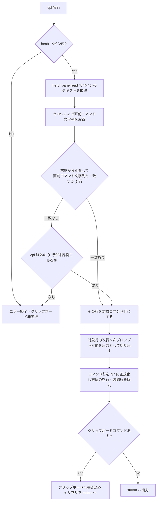

# cpl: 直前のコマンドと出力をクリップボードへコピー

## 目的

同じターミナル（= 同じ herdr ペイン）で直前に実行したコマンドと、その出力をまとめてクリップボードへコピーする zsh コマンド `cpl` を追加する。issue 起票や AI への貼り付けで、スクロールして手で選択する手間をなくす。

## 前提

- シェルは herdr のペイン内で動く（`HERDR_ENV=1` / `HERDR_PANE_ID`）。スクロールバックは `herdr pane read <pane> --source recent-unwrapped --format text` で取得する
- プロンプトは starship の3行ブロック（空行 / パワーライン行 / `❯ <コマンド>`）。`❯` 始まりの行をコマンド行の境界として使う
- herdr 外では機能させず、エラー終了する

## 振る舞い

## 要件チェックリスト

抽出ロジックは純関数 `__cpl_extract <直前コマンド文字列>`（ペインテキストを stdin で受け、`$ <コマンド>` + 出力を stdout へ）としてユニットテストする。

- [x] R1 基本形: `❯ echo hello` + 出力2行 + 次プロンプトブロック → `$ echo hello` + 出力2行を返す（次プロンプト以降は含めない）
- [x] R2 出力なし: `❯ true` の直後に次プロンプト → `$ true` の1行のみを返す（末尾に空行を残さない）
- [x] R3 履歴不一致時のフォールバック: 直前コマンド文字列に一致する行が無ければ、末尾の `cpl` 行を読み飛ばして直近の非 cpl コマンド行を対象にし、コマンド文字列はペインの行から取る
- [x] R4 出力中の偽プロンプト: 出力行が `❯ ` で始まっていても、切り出しの終端は自分自身（`cpl`）の実行行とし、偽プロンプト行を出力に含める
- [x] R5 プロンプト行なし: `❯` 行が1つも無いテキストでは非0終了し、何も出力しない
- [x] R6 直接確認: herdr 外（`HERDR_ENV` 未設定）では `cpl` がエラーメッセージを出して非0終了し、クリップボードを触らない
- [x] R7 直接確認: 実ペインで `cpl` を実行すると、クリップボードに `$ <コマンド>` + 出力が入り、コピー行数のサマリが表示される
- [ ] R8 cpl 連投: 履歴から取れた直前コマンドが `cpl` 自身の場合、それを対象行として採用せずフォールバックする（`HIST_IGNORE_ALL_DUPS` の有無に依存しない）

## インターフェース

| 項目 | 内容 |
|---|---|
| コマンド | `cpl`（引数なし） |
| 配置 | `dot_zsh/copy-last.zsh` を `dot_zsh/plugins.zsh.tmpl` から `source_cache_script` で読み込む |
| テスト | `scripts/test-copy-last.zsh`（zsh のみ。`zsh scripts/test-copy-last.zsh` で実行） |
| 環境変数 | `CPL_PROMPT_MARK`（既定 `❯`）、`CPL_SCAN_LINES`（既定 2000） |
| クリップボード | WSL: `clip.exe` / macOS: `pbcopy` / Wayland: `wl-copy` / X11: `xclip` の順で検出。無ければ stdout |
